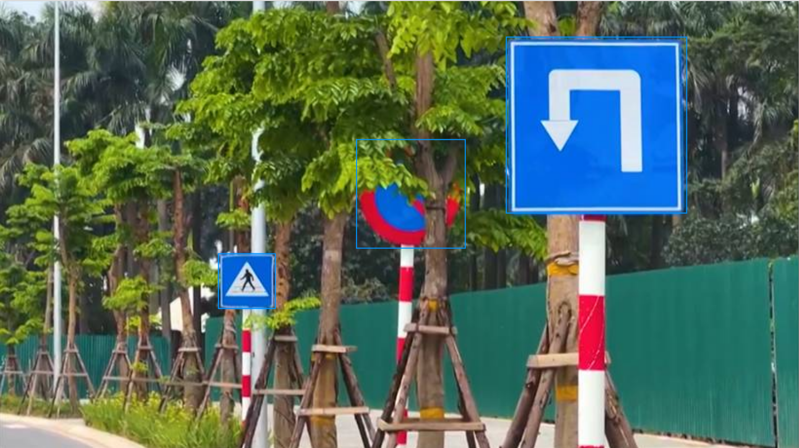
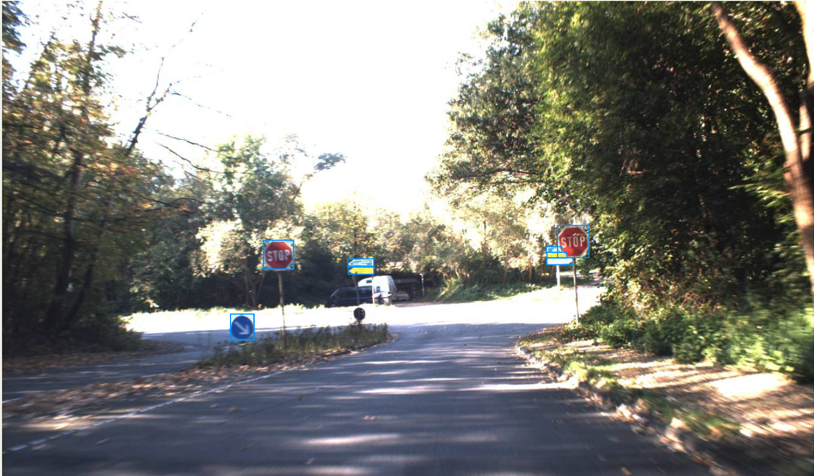
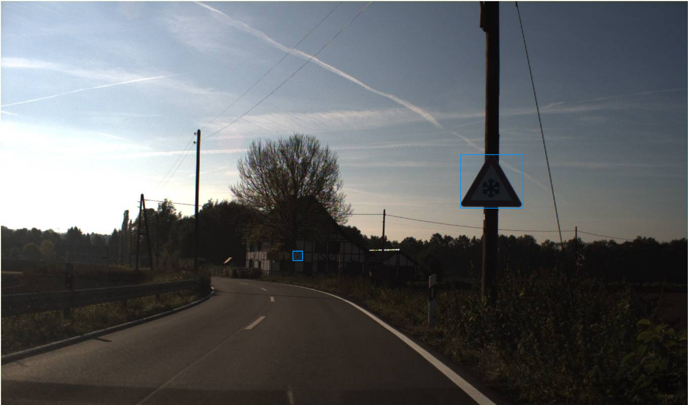
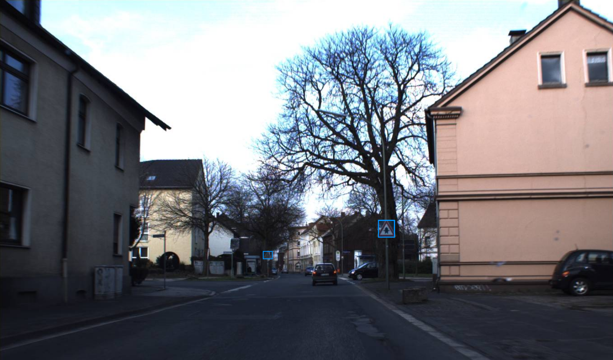

# Annotation guideline: Hướng dẫn gán nhãn phân tầng và phát hiện hộp bao biển báo giao thông — GTSDB

**Version:** v2

> [!TIP]
> **Bản trực quan hóa tương tác (HTML Visual Guide):** Người gán nhãn hoặc nhóm peer có thể mở file [guideline_visualizer.html](file:///home/dp/Documents/projects/team10team/K4-L2-DAY09-Road-Elements-Lab-Student-VuongTuanDuong-2A202602046/guideline-challenge/project/guideline_visualizer.html) bằng trình duyệt web (Chrome/Edge) để xem minh họa trực quan Good/Bad bbox, sơ đồ góc nhìn hiệu lực chống phanh oan, mẫu ảnh GTSDB và làm bài trắc nghiệm thực hành nhanh.

---

### Thông tin dự án & Phân công trách nhiệm (Team 09)

- **Đơn vị thực hiện:** Team 09 (Thử thách Guideline Design Challenge — Day 09)
- **Đối tác Peer Review / Blind Test:** Team 01 (Nhóm peer test bài của Team 09 và Team 09 test bài của Team 01)
- **Problem Family:** Traffic sign taxonomy (Phân tầng biển báo đường bộ phục vụ xe tự hành)
- **Nguồn dữ liệu:** Bộ dữ liệu chuẩn `gtsdb` (German Traffic Sign Detection Benchmark — 28 ảnh độ phân giải cao $1360 \times 800$), có mở rộng liên kết bối cảnh `lisa` và `bdd100k` theo hợp đồng bài toán.
- **Bảng phân vai và đầu mối liên hệ kỹ thuật:**
  - **Spec Owner:** Phạm Hữu Hải (`01_problem_statement.md`, `00_team.md`) — Phụ trách hợp đồng downstream contract và ràng buộc an toàn ADAS.
  - **Guideline Owner:** Nguyễn Tú Anh (`02_guideline.md`) — Tác giả và chịu trách nhiệm nội dung quy chuẩn gán nhãn v2.
  - **CVAT & Data Owner:** Vương Tuấn Dương (`03_cvat_labels.json`, `03_ontology_and_cvat_setup.md`, `sample_pack.csv`, `09_cvat_export_or_task_reference.txt`) — Cấu hình schema CVAT và quản trị dataset.
  - **Gold & Edge-case Owner:** Ngô Duy Ngọc (`04_edge_cases/edge_case_cards.md`, `04_edge_cases/gold_decisions.csv`) — Quản lý thư viện ca biên và tập quyết định chuẩn vàng.
  - **QA & Blind Handoff Owner:** Phạm Xuân Duy (`05_qa_plan.md`, `06_calibration_report.csv`, `07_blind_handoff/`, `08_revision_log.md`) — Kiểm soát chất lượng, đo lường bất đồng calibration và điều phối bàn giao blind test.

---

## 1. Objective + scope

### 1.1 Mục tiêu kỹ thuật (Downstream Contract)
Dữ liệu gán nhãn từ guideline này phục vụ trực tiếp cho mô hình đa nhiệm **2-stage / Multitask Object Detection & Attribute Classification** (như YOLOv8/Faster R-CNN tích hợp Multi-attribute Classification Head). 

Đối tượng tiêu thụ dữ liệu hạ nguồn (Downstream Consumer) là **hệ thống điều khiển và lập kế hoạch hành trình ADAS L2+/L3 (Decision & Planning)**. Bounding box không chỉ đơn thuần xác định vị trí không gian (localization) mà các thuộc tính phân tầng (`sign_group`, `relevance`, `occlusion`, `legibility`) là đầu vào quyết định các hành vi tự lái sống còn: phát hiện biển dừng/cấm để dừng xe, nhận diện biển cảnh báo để giảm tốc độ, và phân tách biển quay lưng/đường phụ để triệt tiêu hiện tượng phanh gấp vô cớ (**phantom braking**).

### 1.2 Phạm vi gán nhãn (In-scope)
Bắt buộc vẽ bounding box và gán đầy đủ thuộc tính cho:
1. **Tất cả các biển báo giao thông chuẩn** thuộc hệ thống công ước Vienna (biển chuẩn Châu Âu trong GTSDB) hoặc hệ thống biển chuẩn Mỹ (trong tập đối sánh mở rộng): biển cấm, biển dừng, biển cảnh báo nguy hiểm, biển hiệu lệnh, biển chỉ dẫn, biển ưu tiên.
2. **Biển báo phụ (supplementary plate):** Các tấm biển phụ dạng hình chữ nhật gắn độc lập bên dưới biển chính, bổ sung thông tin cự ly, thời gian, hoặc loại phương tiện áp dụng.
3. **Hình thức lắp đặt:** Biển gắn trên cọc kim loại ven đường, treo trên giá long môn (overhead gantry), gắn trên dải phân cách hoặc rào chắn công trường.
4. **Trạng thái quan sát:** Biển nguyên vẹn hoặc bị che khuất một phần ($< 80\%$), biển nghiêng do góc chụp camera, biển bị lóa/mờ nhẹ nhưng con người vẫn nhận diện được viền và hình khối.
5. **Kích thước tối thiểu:** Kích thước cạnh dài nhất $L = \max(w, h) \ge 12 \text{ px}$ (tính theo tọa độ pixel thực tế của ảnh gốc $1360 \times 800$).

### 1.3 Ngoại vi phạm vi (Out-of-scope / IGNORE)
Tuyệt đối **KHÔNG** tạo bounding box (`IGNORE`) đối với:
1. **Đối tượng quá nhỏ:** Biển báo có $L = \max(w, h) < 12 \text{ px}$ trên ảnh gốc, không đủ điểm ảnh để xác định viền ngoài đáng tin cậy.
2. **Cơ cấu nâng đỡ và hạ tầng phụ:** Cột cọc, giá long môn, khung treo biển, dây cáp, bóng đổ của biển hoặc quầng sáng lóa (halo/flare).
3. **Mặt sau của biển quay 180° trơn nhẵn:** Mặt sau hoàn toàn của biển báo (mặt phẳng kim loại/xám không có viền phản quang, không có nội dung).
4. **Biển hiệu phi giao thông:** Bảng quảng cáo thương mại, số nhà, biển tên trạm xăng dầu, pano áp phích ven đường.
5. **Hình in giả lập:** Biển báo dán/in trên thân xe tải, xe buýt, áo phản quang của người đi bộ hoặc rào chắn tạm không có chức năng báo hiệu giao thông.
6. **Thành phần hạ tầng giao thông khác:** Đèn tín hiệu giao thông (traffic light), vạch kẻ đường, cọc tiêu mềm, gờ giảm tốc.

---

## 2. Annotation unit

- **Quy cách hình học:** Sử dụng công cụ **Shape / Rectangle** (hình chữ nhật có các cạnh song song với trục ảnh $x, y$). Tuyệt đối **không dùng Track** (do tập ảnh GTSDB gồm các ảnh tĩnh độc lập).
- **Nguyên tắc phân rã Instance:**
  - Mỗi mặt biển vật lý độc lập là **đúng 1 instance** `traffic_sign`.
  - **Cụm biển lắp chung một cột:** Nếu một cột có 2 hoặc 3 biển báo xếp chồng lên nhau (ví dụ: Biển cấm vượt ở trên, Biển phụ cự ly ở dưới), annotator phải vẽ **từng box riêng biệt** cho từng mặt biển. Nghiêm cấm vẽ 1 box to bao trùm toàn bộ cột hoặc gộp nhiều biển thành một.
  - **🔴 EDGE CASE ĐẶC BIỆT — BIỂN Ở XA CÓ 2 MÀU KHÁC NHAU:**
    - Khi quan sát ở cự ly xa, một cột biển thường xuất hiện dưới dạng một cụm nhỏ gồm **2 dải màu sắc/hình khối khác biệt xếp chồng theo trục dọc** (ví dụ: đốm màu đỏ/vàng của biển cấm/cảnh báo ở trên, và đốm màu trắng/xanh của biển phụ hoặc biển hiệu lệnh ở dưới).
    - **Quy tắc bắt buộc:** Dù ở xa kích thước hiển thị rất nhỏ (mỗi mảng chỉ từ $12\text{ px}$ đến $18\text{ px}$), annotator **BẮT BUỘC PHẢI GÁN 2 BOUNDING BOX RIÊNG BIỆT**, một box cho mảng màu phía trên và một box cho mảng màu phía dưới.
    - **Cấm gộp box:** Tuyệt đối **KHÔNG** vẽ 1 box to bao trùm cả 2 mảng màu, vì sẽ làm sai hoàn toàn tỷ lệ khung hình $(w/h)$ của mặt biển và làm hỏng đầu ra phân loại thuộc tính của downstream model.
    - **Cấm bỏ sót biển dưới:** Tuyệt đối **KHÔNG** chỉ vẽ biển màu đỏ phía trên mà bỏ quên biển màu trắng/xanh phía dưới.
  - **Biển có nhiều thông tin trên cùng một tấm mặt:** Nếu một tấm biển kim loại duy nhất chứa nhiều biểu tượng hoặc chữ viết, chỉ vẽ **1 bounding box duy nhất** bao trọn toàn bộ tấm biển đó.
  - **Biển bị vật cản cắt ngang (occlusion split):** Nếu một mặt biển bị cành cây, dây điện hoặc cột đèn chắn ngang chia mặt biển thành 2 phần nhìn thấy tách rời, annotator vẽ **1 bounding box duy nhất** bao phủ toàn bộ vùng biên ngoài của mặt biển (box chấp nhận chứa vật cản ở phần giữa). Không tách thành 2 box nhỏ.
  - **Không liên kết định danh (No tracking):** Mỗi ảnh được gán độc lập; cùng một biển xuất hiện ở các ảnh khác nhau vẫn được gán như các instance mới, không liên kết ID giữa các ảnh.

---

## 3. Geometry rule

### 3.1 Quy tắc dựng hộp bao (Bounding Box Fitting)
- Box phải được kéo ôm sát mép ngoài cùng của **phần mặt hiển thị nhìn thấy (visible face)** của biển báo, bao gồm cả viền phản quang ngoài cùng của mặt biển.
- **Điểm biên:** Bounding box được xác định bởi 2 cặp tọa độ trên ảnh gốc: góc trên bên trái $(x_{min}, y_{min})$ và góc dưới bên phải $(x_{max}, y_{max})$.
- **Không vẽ tràn ra ngoài:** Box không được bao trùm phần cọc sắt gắn biển, không lấy bóng đổ trên mặt đường và không lấy phần quầng sáng xung quanh khi chụp ngược sáng.
- **Biển cắt mép khung hình (truncation):** Nếu biển báo nằm ở rìa bức ảnh và bị cắt cụt một phần, cạnh của bounding box phải dừng chính xác tại biên ảnh ($x=0$, $x=1360$, $y=0$, hoặc $y=800$). Tuyệt đối không suy đoán vẽ tràn ra ngoài vùng ảnh.
- **Ranh giới tiếp giáp giữa 2 box trong cụm biển xếp chồng ở xa:** Khi 2 biển gắn sát nhau trên cùng một cột ở khoảng cách xa, cạnh đáy của box trên ($y_{max1}$) và cạnh đỉnh của box dưới ($y_{min2}$) phải đặt tiếp giáp trực tiếp tại đúng dải pixel phân cách màu sắc giữa 2 biển (ví dụ điểm chuyển giao giữa dải đỏ và dải trắng). Độ chồng lấn giữa 2 box cho phép $\le 1 \text{ px}$, tuyệt đối không chừa khoảng trống nhân tạo giữa 2 mặt biển.

### 3.2 Công thức kích thước & Ngưỡng lọc
- Đo đạc trực tiếp trên tọa độ ảnh gốc (không đo theo kích thước hiển thị trên màn hình zoom):
  $$\text{Chiều rộng: } w = x_{max} - x_{min}$$
  $$\text{Chiều cao: } h = y_{max} - y_{min}$$
  $$\text{Kích thước đặc trưng: } L = \max(w, h)$$
- **Quy tắc ngưỡng:**
  - Nếu $L \ge 12 \text{ px}$ và có đủ bằng chứng nhận diện viền mặt biển: **Bắt buộc vẽ box (`LABEL`)**.
  - Nếu $L < 12 \text{ px}$: **Bỏ qua (`IGNORE`)**.
  - Nếu nghi ngờ đối tượng là biển báo nhưng không thể định vị được viền ngoài chính xác do nhiễu hạt: chuyển sang quy trình Escalation (Mục 7).

### 3.3 Ngưỡng dung sai hình học (QA Geometry Tolerance)
Được chuẩn hóa theo ràng buộc kỹ thuật tại `01_problem_statement.md`:
- **Chỉ số chồng lấn (Intersection over Union - IoU):** Box gán nhãn so với box chuẩn vàng (Gold Reference) phải đạt **$\text{IoU} \ge 0.85$**.
- **Sai số dịch chuyển biên (Edge Shift Deviation):**
  - Đối với biển lớn và trung bình ($L \ge 30 \text{ px}$): Độ lệch tuyệt đối của mỗi cạnh $\le 3 \text{ px}$ ($|\Delta x_{min}| \le 3$, $|\Delta x_{max}| \le 3$, $|\Delta y_{min}| \le 3$, $|\Delta y_{max}| \le 3$).
  - Đối với biển nhỏ ($12 \le L < 30 \text{ px}$): Độ lệch tuyệt đối của mỗi cạnh $\le 1.5 \text{ px}$.

---

## 4. Taxonomy & Schema định nghĩa

Hệ thống nhãn và thuộc tính tuân thủ tuyệt đối theo `03_cvat_labels.json` và `03_ontology_and_cvat_setup.md`.

### 4.1 Danh mục thực thể (Classes & Tags)
1. **Object Class:** `traffic_sign` (Geometry: `rectangle`) — Áp dụng cho mọi instance biển báo hợp lệ trong phạm vi.
2. **Image Tag:** `image_escalate` (Geometry: `tag`) — Nhãn gán mức độ toàn ảnh khi bức ảnh bị lỗi tệp tin, nhòe chuyển động toàn cảnh hoặc chứa ca bất định nghiêm trọng cần hoãn thẩm định.

### 4.2 Chi tiết thuộc tính của `traffic_sign` (Attributes)

| Tên Attribute | Kiểu nhập | Các giá trị cho phép | Giá trị mặc định | Định nghĩa & Tiêu chuẩn nhận diện trực quan |
|---|---|---|---|---|
| `sign_group` | select | `__undefined__`<br>`prohibitory`<br>`warning`<br>`mandatory`<br>`other_info`<br>`unknown` | `__undefined__` | **Nhóm chức năng của biển báo:**<br>• `prohibitory`: Biển cấm/dừng. Hình tròn viền đỏ nền trắng/xanh; hình bát giác đỏ (STOP); tam giác ngược viền đỏ (Yield/Nhường đường). Ví dụ: Cấm quay đầu, Cấm đi ngược chiều, Giới hạn tốc độ.<br>• `warning`: Biển nguy hiểm/cảnh báo. Hình tam giác đều viền đỏ đỉnh hướng lên nền vàng/trắng (Vienna); hoặc hình thoi vàng viền đen (chuẩn Mỹ). Ví dụ: Khúc cua nguy hiểm, Công trường, Giao nhau với đường ưu tiên.<br>• `mandatory`: Biển hiệu lệnh. Hình tròn nền xanh lam với mũi tên/biểu tượng màu trắng chỉ hướng đi bắt buộc, làn xe buýt, tốc độ tối thiểu.<br>• `other_info`: Biển chỉ dẫn & biển phụ. Biển thông tin làn đường, biển tên đường, biển hình thoi vàng viền trắng (Priority Road), và tất cả các biển phụ hình chữ nhật gắn dưới biển chính.<br>• `unknown`: Mặt trước của biển bị suy giảm chất lượng nặng, bạc màu hoặc lóa sáng đến mức không thể xếp vào 4 nhóm trên dù vẫn thấy rõ viền biển. |
| `relevance` | select | `__undefined__`<br>`facing_ego`<br>`facing_away`<br>`lateral` | `__undefined__` | **Hướng hiệu lực tác động tới xe tự hành (Ego vehicle):**<br>• `facing_ego`: Biển hướng thẳng hoặc chếch góc vào tầm nhìn xe mình, có hiệu lực chi phối trực tiếp tới hành vi lái xe trên làn đường Ego đang di chuyển.<br>• `facing_away`: Biển quay lưng (mặt trước xoay góc $> 90^\circ$ so với hướng di chuyển của xe mình, ví dụ biển của làn đường ngược chiều hoặc nhìn thấy góc xiên cạnh sau).<br>• `lateral`: Biển hướng vuông góc sang làn đường nhánh, đường giao cắt hoặc đường song song cách biệt; không điều khiển luồng giao thông của làn Ego đang chạy. |
| `occlusion` | select | `none`<br>`partial`<br>`heavy` | `none` | **Mức độ che khuất bề mặt hiển thị của biển:**<br>• `none`: Mặt biển hiển thị hoàn chỉnh hoặc bị che $< 10\%$ diện tích.<br>• `partial`: Bị che khuất từ $10\%$ đến $50\%$ (ví dụ cành cây, cột đèn, phương tiện khác che một góc nhưng vẫn nhận dạng rõ hình học/nội dung).<br>• `heavy`: Bị che khuất từ $> 50\%$ đến $80\%$ diện tích (mặt biển bị che phần lớn nhưng vẫn còn bằng chứng tin cậy để nhận diện). *Ghi chú: Nếu bị che $> 80\%$, xem xét IGNORE hoặc Escalate.* |
| `legibility` | select | `legible`<br>`unreadable` | `legible` | **Khả năng đọc hiểu nội dung/ký hiệu:**<br>• `legible`: Khi zoom ảnh gốc, mắt người bình thường có thể đọc rõ chữ số, mũi tên hoặc biểu tượng bên trong biển.<br>• `unreadable`: Biển bị mờ do độ phân giải thấp, nhòe chuyển động (motion blur), hoặc chói sáng khiến không thể đọc được nội dung chi tiết bên trong, dù vẫn nhận dạng được hình khối biển báo. |
| `escalate_review` | checkbox | `false`<br>`true` | `false` | **Đánh dấu ca khó cần hội chẩn:**<br>• `false`: Quyết định gán nhãn đã chắc chắn.<br>• `true`: Đánh dấu khi annotator gặp ca biên phân vân (viền mờ, không rõ nhóm chức năng, góc xoay ranh giới giữa `facing_ego` và `lateral`) cần Reviewer/Team Lead xử lý. |

> [!CRITICAL]
> **Quy định bắt buộc về giá trị mặc định:**
> Hai thuộc tính `sign_group` và `relevance` được cấu hình mặc định là `__undefined__`. Đây là cơ chế chống lỗi chủ đích (anti-bias design) được thỏa thuận giữa Spec Owner và CVAT Owner. Khi xuất file annotation, bất kỳ box nào còn sót giá trị `__undefined__` sẽ bị hệ thống QA gắn cờ lỗi nặng (Major Error) và từ chối nghiệm thu.

---

## 5. Inclusion / exclusion matrix

Ma trận tra cứu nhanh hành động cho người gán nhãn:

| Ngữ cảnh quan sát | Kích thước & Điều kiện | Quyết định (Decision) | Thao tác trên CVAT |
|---|---|---|---|
| Biển chuẩn, rõ nét, viền xác định | $L \ge 12 \text{ px}$ | **LABEL** | Vẽ rectangle `traffic_sign`, chọn `sign_group`, `relevance`, `occlusion = none`, `legibility = legible`. |
| Biển bị mờ/xa nhưng nhận diện được nhóm | $L \ge 12 \text{ px}$ | **LABEL** | Vẽ rectangle, chọn đúng nhóm biển, chọn `legibility = unreadable`. |
| Cột có nhiều biển báo xếp dọc | Mỗi biển $L \ge 12 \text{ px}$ | **LABEL riêng** | Vẽ từng rectangle cho từng mặt biển riêng biệt. |
| **Cụm biển ở xa có 2 màu khác nhau (đốm đỏ trên, đốm trắng/xanh dưới)** | Kích thước nhỏ ($L \approx 12 - 18\text{ px}$) | **LABEL 2 box riêng** | **Bắt buộc vẽ 2 rectangle riêng biệt** ôm sát từng dải màu; gán box trên là `prohibitory`/`warning`, box dưới là `other_info`/`mandatory`. Tuyệt đối không gộp 1 box. |
| Biển phụ hình chữ nhật gắn dưới biển chính | $L \ge 12 \text{ px}$ | **LABEL** | Vẽ rectangle riêng, gán `sign_group = other_info`. |
| Biển cấm ở đường gom/nhánh rẽ | $L \ge 12 \text{ px}$ | **LABEL** | Vẽ rectangle, chọn `sign_group = prohibitory`, chọn `relevance = lateral`. |
| Biển cấm ở làn ngược chiều (ngoảnh mặt đi) | Thấy viền trước/nghiêng | **LABEL** | Vẽ rectangle, chọn `relevance = facing_away`. |
| Mặt sau biển quay trơn nhẵn $180^\circ$ | Không thấy viền trước | **IGNORE** | Không vẽ box. |
| Biển quá xa hoặc quá nhỏ | $L < 12 \text{ px}$ | **IGNORE** | Không vẽ box. |
| Biển quảng cáo, trạm xăng, số nhà | Mọi kích thước | **IGNORE** | Không vẽ box. |
| Đèn giao thông, cọc tiêu, vạch kẻ đường | Mọi kích thước | **IGNORE** | Không vẽ box. |
| Biển bị che $> 80\%$ không còn hình thù | Mọi kích thước | **IGNORE** | Không vẽ box. |
| Nghi ngờ là biển nhưng viền quá nhòe | $L \ge 12 \text{ px}$ | **ESCALATE** | Vẽ rectangle, chọn `sign_group = unknown`, tick `escalate_review = true`. |
| Toàn bộ frame ảnh bị hỏng/đen/chói lóa | Toàn ảnh | **TAG ESCALATE** | Chọn công cụ Tag trên thanh công cụ CVAT $\rightarrow$ gán nhãn `image_escalate`. |

---

## 6. Visibility, occlusion & edge conditions

### 6.1 Biển nhỏ và ở cự ly xa (Small / Far objects)
- Phóng to ảnh (zoom) để kiểm tra cấu trúc pixel gốc. Không sử dụng các công cụ nội suy tăng nét AI làm sai lệch điểm ảnh.
- Dùng công cụ thước đo hoặc tọa độ box để kiểm tra: Nếu $L = \max(w, h) < 12 \text{ px}$, kiên quyết bỏ qua (`IGNORE`).
- Nếu $12 \le L < 20 \text{ px}$, đặc biệt chú ý quan sát màu sắc viền (đỏ/xanh) để không bỏ sót các biển cấm (`prohibitory`) hoặc biển cảnh báo (`warning`).

### 6.2 Hiện tượng mờ, chói sáng (Blur / Flare / Glare)
- Chụp ban ngày ngược sáng hoặc chụp ban đêm dưới ánh đèn pha thường tạo ra quầng sáng (halo) quanh biển báo phản quang.
- **Quy tắc:** Bounding box chỉ bao quanh phần vật lý của mặt biển, tuyệt đối không mở rộng box để bao trùm quầng sáng loang ra xung quanh.
- Nếu lóa sáng làm mất toàn bộ họa tiết bên trong nhưng hình dáng hình học (tròn/tam giác) vẫn rõ: Gán `legibility = unreadable` và chọn `sign_group` tương ứng theo hình khối.

### 6.3 Che khuất một phần (Partial Occlusion)
- Khi biển báo bị cành cây, cọc tiêu, hoặc xe tải che khuất:
  - Nếu phần nhìn thấy đủ để suy luận đường viền vật lý của biển: Vẽ 1 box bao phủ toàn bộ diện tích phần nhìn thấy cộng với phần bị che khuất suy diễn hợp lý (để giữ nguyên hình khối chuẩn của biển).
  - Đánh giá tỷ lệ diện tích bị che: $< 10\% \rightarrow$ `occlusion = none`; $10\% - 50\% \rightarrow$ `occlusion = partial`; $> 50\% - 80\% \rightarrow$ `occlusion = heavy`.
  - Nếu bị che quá $80\%$, không còn đủ thông tin để downstream model học nhận dạng: chuyển sang `IGNORE` (nếu chắc chắn không thể dùng) hoặc `escalate_review = true` (nếu cần trưởng nhóm phán quyết).

### 6.4 Góc nghiêng phối cảnh (Perspective Distortion)
- Biển báo nằm ở góc cua hoặc ven vỉa hè thường bị nghiêng so với mặt phẳng camera.
- Vẫn dùng bounding box 2D hình chữ nhật song song trục tọa độ để đóng khung phần bao ngoài cùng của mặt biển nghiêng.
- Đánh giá hướng: Nếu góc nghiêng mở về phía xe Ego $< 60^\circ \rightarrow$ `relevance = facing_ego`; nếu nghiêng quay đi $> 90^\circ \rightarrow$ `relevance = facing_away`; nếu quay sang đường giao cắt vuông góc $\rightarrow$ `relevance = lateral`.

### 6.5 Ảnh phản chiếu (Reflection)
- Biển báo phản chiếu trên nắp ca-pô xe mình, trên mặt đường ướt sũng nước mưa hoặc trên kính tòa nhà ven đường: **Tuyệt đối không gán nhãn (`IGNORE`)**. Chỉ gán nhãn thực thể vật lý thực thụ trên đường.

### 6.6 Edge case đặc thù: Biển ở xa có 2 màu khác nhau (Distant multi-color stacked signs)
- **Bản chất vật lý và hiện tượng quang học:**
  - Ở cự ly xa, một cột biển giao thông thường treo 2 biển: biển chính phía trên (thường là viền đỏ nền trắng/vàng cảnh báo hoặc cấm) và biển phụ phía dưới (nền trắng chữ đen bổ nghĩa cự ly/thời gian) hoặc biển hiệu lệnh (nền xanh lam).
  - Do góc máy xa và hiệu ứng nén phối cảnh (telephoto/perspective compression), kích thước của từng biển bị thu hẹp đáng kể (mỗi biển chỉ đạt từ $12 \text{ px}$ đến $18 \text{ px}$). Mắt thường nhìn lướt qua dễ bị ảo giác coi đây là "một vật thể duy nhất có 2 màu" hoặc chỉ chú ý vào đốm màu đỏ rực rỡ ở trên mà hoàn toàn bỏ qua đốm màu trắng/xanh mờ nhạt ở dưới.
- **Quy tắc gán nhãn bắt buộc (Mandatory Dual-Box Rule):**
  1. **Nhận diện bằng độ tương phản màu sắc:** Khi zoom ảnh ở $100\%$ pixel gốc, nếu phát hiện cấu trúc gồm 2 khối màu độc lập xếp chồng nhau theo trục dọc (hoặc trục ngang), annotator **BẮT BUỘC PHẢI TẠO 2 BOUNDING BOX RIÊNG BIỆT**.
  2. **Cách đặt viền box:**
     - Box 1 (phía trên): Ôm trọn mảng pixel màu đỏ/vàng của biển chính.
     - Box 2 (phía dưới): Ôm trọn mảng pixel màu trắng/xanh của biển phụ hoặc biển hiệu lệnh.
     - Cạnh dưới của Box 1 và cạnh trên của Box 2 tiếp giáp nhau tại vạch ranh giới chuyển giao màu sắc, độ lệch chồng lấn $\le 1 \text{ px}$.
  3. **Gán thuộc tính:**
     - Box trên: Thường có màu đỏ $\rightarrow$ gán `sign_group = prohibitory` (hoặc `warning` nếu đỉnh hướng lên); `relevance = facing_ego`; `legibility = unreadable` (vì ở xa không đọc được số bên trong).
     - Box dưới: Thường có màu trắng $\rightarrow$ gán `sign_group = other_info` (biển phụ); `relevance = facing_ego`; `legibility = unreadable`.
  4. **Quy tắc Escalation:** Nếu cụm biển ở quá xa tới mức bị nhòe bệt màu (color bleeding), hai dải màu trộn lẫn vào nhau không thể xác định được đường ranh giới tiếp giáp để phân chia 2 box: Annotator vẽ 1 box bao trọn cụm và tick ngay `escalate_review = true` để hội đồng QA thẩm định.

---

## 7. Ambiguity, escalation & Downstream Critical Risks

### 7.1 Ma trận lỗi chí mạng (Safety-Critical Failure Modes)
Căn cứ hợp đồng downstream contract tại `01_problem_statement.md`, hai nhóm lỗi sau đây được phân loại là **Lỗi chí mạng (Critical Failure)** trong quy trình QA và chấm điểm Gold Decision:

```
+----------------------------------------------------------------------------------------------------+
|                                    SAFETY-CRITICAL RISK MATRIX                                     |
+----------------------------------------------------------------------------------------------------+
| 1. FALSE NEGATIVE Ở BIỂN AN TOÀN (Critical Risk 1)                                                 |
|    - Hành vi sai phạm: Bỏ sót không gán (miss), gán nhãn IGNORE, hoặc phân loại sai sign_group cho    |
|      biển cấm (prohibitory: STOP, Cấm đi ngược chiều, Giới hạn tốc độ) hoặc biển cảnh báo nguy hiểm |
|      (warning) đang hướng thẳng về xe mình (facing_ego).                                           |
|    - Hậu quả downstream: Xe tự hành lao qua giao lộ nguy hiểm mà không giảm tốc/dừng xe, dẫn đến  |
|      nguy cơ va chạm và tai nạn trực diện nghiêm trọng.                                            |
+----------------------------------------------------------------------------------------------------+
| 2. FALSE POSITIVE HƯỚNG HIỆU LỰC (Critical Risk 2)                                                 |
|    - Hành vi sai phạm: Gán nhầm relevance = facing_ego cho biển cấm/giới hạn tốc độ đang quay lưng  |
|      (facing_away) hoặc biển thuộc làn đường nhánh, đường gom song song (lateral).                  |
|    - Hậu quả downstream: Hệ thống ADAS hiểu nhầm biển cấm của làn đường khác áp dụng cho mình,     |
|      kích hoạt phanh gấp đột ngột (phantom braking) giữa đường tốc độ cao, gây tai nạn dồn toa     |
|      từ các xe chạy phía sau.                                                                      |
+----------------------------------------------------------------------------------------------------+
```

### 7.2 Biểu diễn các quyết định trong CVAT Export
1. **LABEL:** Tạo box `traffic_sign` kèm chọn đủ 5 thuộc tính.
2. **IGNORE:** Không tạo box trên đối tượng. Khi chấm thi và QA, sự vắng mặt của box tại vị trí đối tượng ngoài scope là bằng chứng của quyết định IGNORE đúng.
3. **UNKNOWN / ESCALATE:** Tạo box `traffic_sign`, chọn `sign_group = unknown` (hoặc `other_info` nếu nghiêng về biển chỉ dẫn), và bắt buộc tick checkbox `escalate_review = true`.
4. **TAG ESCALATE:** Chọn nhãn `image_escalate` kiểu `tag` cho toàn ảnh.

### 7.3 Quy trình phân giải và leo thang (Escalation Protocol)
- **Trong nội bộ nhóm (Calibration & Gold Creation):**
  1. Khi annotator gặp ca mâu thuẫn hoặc không thể xác định viền ngoài/thuộc tính sau 2 phút xem xét: Annotator tạo box, tick `escalate_review = true` (hoặc gắn tag `image_escalate`).
  2. Ghi chép ngay thông tin vào biên bản review nội bộ: `sample_id`, tọa độ box ước lượng, và mô tả vướng mắc.
  3. **Escalation Path:** Ca vướng mắc được chuyển trực tiếp cho QA Owner (Phạm Xuân Duy) và Gold Owner (Ngô Duy Ngọc). Nếu hai bên chưa đồng thuận, Spec Owner (Phạm Hữu Hải) sẽ là người đưa ra phán quyết cuối cùng dựa trên Downstream Contract.
  4. Sau khi chốt quyết định, tình huống biên sẽ được văn bản hóa thành 1 thẻ tại `04_edge_cases/edge_case_cards.md` và cập nhật vào guideline.
- **Trong phiên Blind Test với đối tác (Team 01):**
  1. Nhóm đối tác Team 01 khi thực hiện blind test trong 15 phút sẽ tuyệt đối **không nhận được giải thích bằng miệng** từ Team 09.
  2. Mọi thắc mắc của Team 01 được ghi nhận nguyên văn vào `07_blind_handoff/clarification_log.csv` (`time,asker,question,answered_how,guideline_change`).
  3. Nếu Team 01 không hiểu rule và phải đặt câu hỏi, đó là bằng chứng trực tiếp cho thấy guideline còn lỗ hổng (Guideline Gap) cần khắc phục ở phiên bản tiếp theo.

---

## 8. Temporal rule

- **Tập dữ liệu tĩnh GTSDB:** Hiện tại, thử thách Day 09 thực thi trên tập 28 ảnh tĩnh `gtsdb`. Mỗi bức ảnh là một bối cảnh độc lập.
- **Quy tắc:** Tuyệt đối không dùng tính năng Tracking của CVAT; không ngoại suy hoặc đoán nhận vị trí biển báo dựa trên chuỗi thời gian.
- **Mở rộng (khi làm việc với LISA Video):** Nếu mở rộng sang video clip liên tiếp 30 frames của LISA, mỗi cột biển là một `Track`, các thuộc tính hình thái như `occlusion` có thể chuyển thành `mutable` qua từng frame; khi xe chạy vượt qua biển và biển ra khỏi khung hình, annotator bắt buộc bấm phím **O** (Outside) để đóng track, tránh lỗi box kéo dài vô tận.

---

## 9. Concrete examples & Demo thực tế từ ảnh gán nhãn mẫu

Dưới đây là bộ ảnh mẫu gán nhãn thực tế đã được đội ngũ QA và Gold Owner kiểm duyệt, lưu trữ tại thư mục `images/guideline-images/`. Các ví dụ này đại diện trực tiếp cho các tình huống gán nhãn điển hình và hóc búa nhất trong môi trường tự hành thực tế:

---

### 9.1 Phân tích các ca gán nhãn mẫu thực tế (`images/guideline-images/`)

#### 📷 Case 1: Xử lý che khuất nặng (Heavy Occlusion) & Phân rã cụm biển
- **Tệp ảnh minh chứng:** [occu.png](../images/guideline-images/occu.png)
- **Bối cảnh hiện trường:** Tuyến đường đô thị có dải phân cách trồng hàng cây xanh rậm rạp. Camera quan sát thấy 3 biển báo ở các cự ly và trạng thái che khuất khác nhau.



- **Phân tích từng bounding box đã gán nhãn mẫu (màu xanh dương):**
  1. **Box 1 (Biển quay đầu xe chữ U to bên phải lề đường):**
     - *Quan sát:* Tấm biển hình vuông to bản màu xanh lam có mũi tên chữ U màu trắng rõ nét, không bị che khuất.
     - *Quy cách vẽ:* Bounding box ôm khít 4 cạnh viền ngoài màu xanh của tấm biển; dừng lại ngay trên điểm tiếp giáp với cọc sọc đỏ trắng (không bao trùm cọc).
     - *Thuộc tính:* `sign_group = mandatory` (hoặc `other_info`), `relevance = facing_ego`, `occlusion = none`, `legibility = legible`, `escalate_review = false`.
  2. **Box 2 (Biển cấm dừng đỗ tròn đỏ-xanh bị cành cây che khuất nặng ở giữa - CA MẪU MỰC):**
     - *Quan sát:* Biển tròn viền đỏ nền xanh cấm đỗ/dừng xe bị thân cây và tán lá che chắn gần một nửa diện tích mặt biển (phần giữa và góc trên bị cành lá đè lên).
     - *Quy cách vẽ:* **Bắt buộc vẽ 1 bounding box hình chữ nhật bao trọn toàn bộ hình tròn vật lý nhìn thấy của biển** (box chấp nhận chứa cành cây và kẽ lá ở phần giữa). Tuyệt đối **không** lẹm mép box vào trong để tránh lá cây, và **không** tách thành 2 box vụn hai bên!
     - *Thuộc tính:* `sign_group = prohibitory`, `relevance = facing_ego`, `occlusion = heavy` (do bị che > 50%), `legibility = legible` (vẫn nhận dạng được hình họa cấm đỗ), `escalate_review = false`.
  3. **Box 3 (Biển người đi bộ qua đường ở cự ly xa bên lề trái):**
     - *Quan sát:* Biển vuông màu xanh có biểu tượng tam giác người đi bộ gắn trên cọc ở xa hơn.
     - *Thuộc tính:* `sign_group = other_info` (hoặc `warning`), `relevance = facing_ego`, `occlusion = none`, `legibility = legible`.
- **💡 Bài học cốt lõi cho Annotator:** Khi gặp biển bị cây cối cắt ngang mặt, nguyên tắc vàng là: **"Giữ nguyên hình khối hình học chuẩn của mặt biển, vẽ 1 box bao trùm và đánh dấu `occlusion = partial` hoặc `heavy`"**.

---

#### 📷 Case 2: Cụm biển xếp chồng nhiều màu (Multi-color Stacked Signs) & Ánh sáng chói lóa
- **Tệp ảnh minh chứng:** [sang.png](../images/guideline-images/sang.png)
- **Bối cảnh hiện trường:** Ngã ba giao cắt ven rừng, ánh sáng ban ngày chiếu rọi cực mạnh tạo độ tương phản cao (High Dynamic Range / Sun Glare). Có 2 cụm biển xếp chồng ở hai bên đường và 1 biển chỉ dẫn ở hậu cảnh.



- **Phân tích từng bounding box đã gán nhãn mẫu:**
  1. **Cụm biển bên phải lề đường (Giao lộ dừng xe):**
     - *Box trên:* Biển bát giác đỏ **STOP** &rarr; Vẽ box ôm khít 8 cạnh bát giác. Gán: `sign_group = prohibitory`, `relevance = facing_ego`, `occlusion = none`, `legibility = legible`.
     - *Box dưới:* Biển phụ/chỉ dẫn hình chữ nhật màu xanh viền vàng gắn ngay bên dưới biển STOP &rarr; **Bắt buộc vẽ box thứ hai riêng biệt tiếp giáp khít với đáy biển STOP**. Gán: `sign_group = other_info`, `relevance = facing_ego`, `occlusion = none`, `legibility = legible`.
     - *Cấm kỵ:* Tuyệt đối không gộp biển STOP và biển chỉ dẫn thành 1 box to!
  2. **Cụm biển bên trái lề đường:**
     - *Box trên:* Biển bát giác đỏ **STOP** &rarr; Vẽ box riêng, `sign_group = prohibitory`, `relevance = facing_ego`.
     - *Box dưới:* Biển tròn nền xanh lam mũi tên trắng chỉ hướng đi bắt buộc &rarr; Vẽ box riêng, `sign_group = mandatory`, `relevance = facing_ego`.
  3. **Biển chỉ dẫn ở xa (Chính giữa ngã ba):**
     - Biển chữ nhật xanh chỉ hướng đường ở cự ly xa &rarr; Vẽ 1 box vừa vặn, gán `sign_group = other_info`, `relevance = facing_ego`, `legibility = unreadable` (do cự ly xa và ánh sáng chói làm mờ chữ bên trong).
- **💡 Bài học cốt lõi cho Annotator:** Đây là minh chứng hoàn hảo cho quy tắc **"Một cột có 2 biển khác màu/khác nhóm thì BẮT BUỘC gán 2 box riêng biệt tiếp giáp nhau"**. Khi gặp nắng chói lóa, chỉ lấy biên phản quang thực của mặt biển, không lấy quầng sáng loang ra tán cây xung quanh.

---

#### 📷 Case 3: Điều kiện ngược sáng / Hoàng hôn thiếu sáng (Low Light / Backlit Scene)
- **Tệp ảnh minh chứng:** [toi.png](../images/guideline-images/toi.png)
- **Bối cảnh hiện trường:** Đường cong nông thôn một làn xe trong điều kiện chiều muộn ngược sáng, bầu trời sáng nhưng mặt đường và cảnh vật ven đường chìm trong bóng tối (Low-light Shadow).



- **Phân tích từng bounding box đã gán nhãn mẫu:**
  1. **Box 1 (Biển tam giác cảnh báo gắn trên cột điện bằng gỗ bên phải):**
     - *Quan sát:* Biển tam giác viền đỏ cảnh báo trượt tuyết gắn trực tiếp vào thân cột điện gỗ bên lề đường. 
     - *Quy cách vẽ:* Bounding box hình chữ nhật đóng khung chính xác 3 đỉnh ngoài cùng của tam giác. Cột điện gỗ đâm thẳng từ trên xuống dưới biển nhưng **box không bao trùm thân cột gỗ**, dừng sát mép tam giác.
     - *Thuộc tính:* `sign_group = warning`, `relevance = facing_ego`, `occlusion = none`, `legibility = legible`.
  2. **Box 2 (Biển nhỏ ở cự ly rất xa bên hông ngôi nhà phía xa):**
     - *Quan sát:* Một biển báo nhỏ gắn ở góc tường ngôi nhà bên lề trái đường cong. Dù khung cảnh bị tối nhưng zoom lên vẫn thấy viền hình học và thỏa mãn $L \ge 12 \text{ px}$.
     - *Thuộc tính:* `sign_group = other_info` (hoặc `warning`), `relevance = facing_ego`, `legibility = unreadable`, `escalate_review = false`.
- **💡 Bài học cốt lõi cho Annotator:** Ở điều kiện ánh sáng yếu, mắt thường dễ bỏ sót các biển nhỏ nằm chìm trong vùng tối của nhà cửa/cây cối. Annotator phải kiên trì rà soát các cột điện và góc tường ven đường; không được lấy thân cọc gỗ vào box.

---

#### 📷 Case 4: Đô thị mùa đông phức tạp & Cành cây rụng lá chằng chịt (Complex Urban Scene)
- **Tệp ảnh minh chứng:** [hard.png](../images/guideline-images/hard.png)
- **Bối cảnh hiện trường:** Khu phố dân cư đô thị mùa đông, các hàng cây rụng lá tạo ra nhiều cành nhánh đan xen phức tạp vào nền trời và nhà cửa.



- **Phân tích từng bounding box đã gán nhãn mẫu:**
  1. **Box 1 (Biển cảnh báo gắn cạnh thân cây cổ thụ bên phải):**
     - *Quan sát:* Biển báo tam giác viền đỏ nằm trong khung bảo vệ vuông màu xanh gắn bên thân cây to. Box ôm sát toàn bộ mặt hiển thị nhìn thấy.
     - *Thuộc tính:* `sign_group = warning`, `relevance = facing_ego`, `occlusion = none`, `legibility = legible`.
  2. **Box 2 (Biển nhỏ ở xa bên lề trái ngã tư):**
     - *Quan sát:* Biển báo nhỏ cắm ở vỉa hè xa phía trước trạm xe buýt/tòa nhà. Đo pixel ảnh gốc đạt $L \ge 12 \text{ px}$.
     - *Thuộc tính:* `sign_group = other_info`, `relevance = facing_ego`, `legibility = unreadable`.
- **💡 Bài học cốt lõi cho Annotator:** Cành cây khô mùa đông dễ gây nhầm lẫn đường viền. Annotator phải phân biệt rõ đâu là nhánh cây đè lên biển và đâu là viền phản quang của biển; không vẽ nhầm vào các bóng đen hoặc biển số nhà ven phố.

---

### 9.2 Các ví dụ bổ sung trích xuất từ dữ liệu GTSDB của nhóm

Các ví dụ dưới đây đối chiếu trực tiếp với các tệp ảnh trong kho `data/gtsdb/`:

### Ví dụ 1: Cụm biển xếp dọc nhiều tầng trên cùng một cột bên lề phải
- **Tệp dữ liệu:** [GTS01.png](file:///home/dp/Documents/projects/team10team/K4-L2-DAY09-Road-Elements-Lab-Student-VuongTuanDuong-2A202602046/guideline-challenge/data/gtsdb/GTS01.png)
- **Hiện trường quan sát:** Đoạn đường quốc lộ ngoại ô, phía lề phải có cụm biển báo gồm 1 biển cấm tròn viền đỏ ở trên và 1 biển phụ hình chữ nhật màu trắng ở dưới gắn chung một cột thép. Xa hơn bên trái có một cụm biển tương tự của chiều đối diện.
- **Expected Annotation:**
  - **Box 1 (Biển chính bên phải):** Tọa độ tham chiếu `(723, 431) - (752, 457)`.
    - `Class`: `traffic_sign`
    - `sign_group`: `prohibitory` (Biển cấm)
    - `relevance`: `facing_ego` (Hướng thẳng vào xe mình)
    - `occlusion`: `none`
    - `legibility`: `legible`
    - `escalate_review`: `false`
  - **Box 2 (Biển phụ ngay dưới Box 1):** Tọa độ tham chiếu `(724, 459) - (751, 474)`.
    - `Class`: `traffic_sign`
    - `sign_group`: `other_info` (Biển phụ cung cấp cự ly áp dụng)
    - `relevance`: `facing_ego`
    - `occlusion`: `none`
    - `legibility`: `legible`
    - `escalate_review`: `false`
- **Quy tắc minh chứng:** Tuyệt đối tách riêng 2 box, không vẽ một box to ôm cả biển cấm lẫn biển phụ. Không bao trùm cọc sắt bên dưới.

### Ví dụ 2: Cụm biển cảnh báo nguy hiểm kết hợp đèn tín hiệu giao thông
- **Tệp dữ liệu:** [GTS03.png](file:///home/dp/Documents/projects/team10team/K4-L2-DAY09-Road-Elements-Lab-Student-VuongTuanDuong-2A202602046/guideline-challenge/data/gtsdb/GTS03.png)
- **Hiện trường quan sát:** Phía bên phải đường có một cụm biển gồm: Biển tam giác viền đỏ cảnh báo công trường/nguy hiểm ở trên, và Biển tròn hiệu lệnh/cấm ở bên dưới. Trên cao giữa làn đường có giàn đèn tín hiệu giao thông.
- **Expected Annotation:**
  - **Box 1 (Biển tam giác trên):** Tọa độ tham chiếu `(1113, 436) - (1152, 473)`.
    - `Class`: `traffic_sign`
    - `sign_group`: `warning` (Biển cảnh báo nguy hiểm)
    - `relevance`: `facing_ego`
    - `occlusion`: `none`
    - `legibility`: `legible`
  - **Box 2 (Biển tròn dưới):** Tọa độ tham chiếu `(1117, 473) - (1146, 502)`.
    - `Class`: `traffic_sign`
    - `sign_group`: `prohibitory` (hoặc `mandatory` tùy biểu tượng)
    - `relevance`: `facing_ego`
    - `occlusion`: `none`
    - `legibility`: `legible`
  - **Đèn tín hiệu giao thông:** `IGNORE` (Không vẽ bất kỳ box nào lên giàn đèn tín hiệu).
- **Quy tắc minh chứng:** Tách biệt ranh giới giữa biển báo đường bộ và đèn tín hiệu hạ tầng; vẽ đúng từng biển trong cụm.

### Ví dụ 3: Biển báo nhỏ, xa tại khu vực công trường dưới gầm cầu
- **Tệp dữ liệu:** [GTS07.png](file:///home/dp/Documents/projects/team10team/K4-L2-DAY09-Road-Elements-Lab-Student-VuongTuanDuong-2A202602046/guideline-challenge/data/gtsdb/GTS07.png)
- **Hiện trường quan sát:** Khu vực cầu vượt và công trường thi công; có các chi tiết biển báo nhỏ cắm cạnh rào chắn bê tông ở khoảng cách xa. Ground truth gốc của bộ dữ liệu nguồn có thể để trống.
- **Quy trình xử lý:**
  - Phóng to kiểm tra từng đối tượng nghi ngờ ở độ phân giải gốc $1360 \times 800$.
  - Nếu đo đạc thấy $L = \max(w, h) \ge 12 \text{ px}$ và có hình khối biển báo xác định: Bắt buộc vẽ box, chọn `legibility = unreadable` nếu không đọc được biểu tượng.
  - Nếu $L < 12 \text{ px}$: Bỏ qua (`IGNORE`), không vẽ box.
  - Nếu đối tượng bị nhòe nặng không thể xác định được mép biên hộp bao: Đánh dấu `escalate_review = true` hoặc gắn tag `image_escalate`.
- **Quy tắc minh chứng:** Không mặc định tệp ground truth gốc của GTSDB là chân lý; mọi đối tượng thỏa mãn $L \ge 12 \text{ px}$ và thuộc scope đều phải được gán nhãn để bảo đảm downstream model không bị thiếu dữ liệu học.

### Ví dụ 4: Biển bị che khuất một phần bởi cành cây ven đường (Occlusion Handling)
- **Tệp dữ liệu minh chứng:** [GTS02.png](file:///home/dp/Documents/projects/team10team/K4-L2-DAY09-Road-Elements-Lab-Student-VuongTuanDuong-2A202602046/guideline-challenge/data/gtsdb/GTS02.png) hoặc [GTS06.png](file:///home/dp/Documents/projects/team10team/K4-L2-DAY09-Road-Elements-Lab-Student-VuongTuanDuong-2A202602046/guideline-challenge/data/gtsdb/GTS06.png)
- **Hiện trường quan sát:** Biển báo giới hạn tốc độ tròn viền đỏ bị tán cây che mất khoảng $20\%$ góc bên phải của mặt biển.
- **Expected Annotation:**
  - Vẽ một bounding box chữ nhật bao trọn hình tròn nguyên bản của biển (box bao trùm cả phần tán cây che phía trên góc phải).
  - Gán thuộc tính: `sign_group = prohibitory`, `relevance = facing_ego`, `occlusion = partial`, `legibility = legible`.
- **Quy tắc minh chứng:** Không cắt cúp mép box lẹm vào trong chỉ để tránh tán cây; giữ nguyên hình học bao quanh mặt biển vật lý.

### Ví dụ 5: Edge case cụm biển ở xa có 2 khối màu khác biệt (Distant Two-Color Stacked Signs)
- **Tệp dữ liệu minh chứng:** [GTS01.png](file:///home/dp/Documents/projects/team10team/K4-L2-DAY09-Road-Elements-Lab-Student-VuongTuanDuong-2A202602046/guideline-challenge/data/gtsdb/GTS01.png) (cụm biển ở xa bên làn đối diện) hoặc [GTS05.png](file:///home/dp/Documents/projects/team10team/K4-L2-DAY09-Road-Elements-Lab-Student-VuongTuanDuong-2A202602046/guideline-challenge/data/gtsdb/GTS05.png) / [GTS15.png](file:///home/dp/Documents/projects/team10team/K4-L2-DAY09-Road-Elements-Lab-Student-VuongTuanDuong-2A202602046/guideline-challenge/data/gtsdb/GTS15.png)
- **Hiện trường quan sát:** Cột biển báo nằm ở xa hậu cảnh (cách camera trên 50 mét); kích thước tổng thể cụm biển chỉ khoảng $25 \text{ px}$ chiều cao, nhưng quan sát zoom $100\%$ thấy rõ **2 mảng màu tách biệt**: mảng trên màu đỏ viền tròn/tam giác ($w \approx 14 \text{ px}, h \approx 13 \text{ px}$) và mảng dưới màu trắng/xanh hình chữ nhật ($w \approx 14 \text{ px}, h \approx 11 \text{ px}$).
- **Expected Annotation:**
  - **Box 1 (Mảng màu đỏ phía trên):**
    - `Class`: `traffic_sign`
    - `sign_group`: `prohibitory` (nếu tròn) hoặc `warning` (nếu tam giác)
    - `relevance`: `facing_ego` (nếu cùng chiều) hoặc `facing_away` (nếu chiều ngược lại)
    - `occlusion`: `none`
    - `legibility`: `unreadable` (ở xa không đọc được nội dung chữ số)
    - `escalate_review`: `false`
  - **Box 2 (Mảng màu trắng/xanh phía dưới):**
    - `Class`: `traffic_sign`
    - `sign_group`: `other_info` (biển phụ) hoặc `mandatory` (biển hiệu lệnh xanh)
    - `relevance`: cùng hướng với Box 1
    - `occlusion`: `none`
    - `legibility`: `unreadable`
    - `escalate_review`: `false`
- **Quy tắc minh chứng:** Bắt buộc vẽ đủ 2 box. Tuyệt đối không gộp 1 box chung và không bỏ sót mảng màu trắng phía dưới.

---

## 10. Common mistakes & Annotator Checklist

### 10.1 Bảng phân tích các lỗi phổ biến và biện pháp khắc phục

| Mã lỗi | Tên lỗi thường gặp | Nguyên nhân gốc rễ | Hậu quả kỹ thuật | Biện pháp ngăn chặn bắt buộc |
|---|---|---|---|---|
| **E-01** | Gộp nhiều biển cùng cột vào 1 box | Annotator thao tác vội, lười tách box | Downstream model học sai kích thước biển, không phân loại được từng thuộc tính | Mỗi mặt biển vẽ 1 box riêng. Đếm số mặt biển trước khi vẽ. |
| **E-02** | Bỏ quên thuộc tính ở giá trị `__undefined__` | Do hệ thống đặt default là `__undefined__` để chống thiên kiến | Annotation xuất ra bị thiếu dữ liệu, vi phạm hợp đồng schema | Chuyển chế độ sang **Attribute Annotation** trên CVAT để kiểm tra từng box trước khi bấm Save. |
| **E-03** | Nhầm lẫn `facing_ego` với `lateral` hoặc `facing_away` | Không phân tích góc hiệu lực tới làn xe mình | **Lỗi chí mạng 2:** Gây ra phantom braking nguy hiểm khi xe phanh oan vì biển đường khác | Luôn tự hỏi: "Biển này có bắt buộc xe Ego phải tuân thủ ngay trên làn này không?". Nếu không $\rightarrow$ chọn `lateral` hoặc `facing_away`. |
| **E-04** | Bỏ sót biển cấm / cảnh báo nhỏ ($12 \le L < 20 \text{ px}$) | Mắt thường nhìn lướt không thấy | **Lỗi chí mạng 1:** Xe tự hành vượt biển cấm/STOP, nguy cơ tai nạn trực diện | Quét kỹ lề đường và giá long môn ở chế độ zoom $100\%$. Đo kích thước trước khi quyết định bỏ qua. |
| **E-05** | Bao trùm cả cột cọc và bóng đổ vào box | Kéo chuột từ chân cọc lên đỉnh biển | IoU giảm mạnh ($< 0.85$), model detect box bị lệch tâm | Chỉ đặt góc trên và góc dưới bám sát mép ngoài của mặt hiển thị tròn/tam giác/chữ nhật của biển. |
| **E-06** | Đo kích thước $12 \text{ px}$ theo màn hình zoom | Nhầm lẫn kích thước hiển thị với pixel ảnh gốc | Gán nhầm các biển siêu nhỏ dưới $12 \text{ px}$ hoặc bỏ sót biển hợp lệ | Xem tọa độ góc $(x_1, y_1), (x_2, y_2)$ hiển thị trên CVAT và tính $L = \max(|x_2-x_1|, |y_2-y_1|)$. |
| **E-07** | Tự ý bỏ qua ca khó mà không báo cáo | Ngại hỏi, đoán mò hoặc bỏ qua | Gây bất đồng ngầm giữa các annotator, kéo tụt điểm GTS | Bắt buộc tick `escalate_review = true` và ghi vào sổ nhật ký QA của nhóm. |
| **E-08** | Gộp chung hoặc bỏ sót biển dưới khi gặp cụm biển ở xa có 2 màu | Thấy cụm biển nhỏ ở xa nên vẽ 1 box bao cả 2 màu, hoặc chỉ vẽ đốm đỏ mà quên đốm trắng/xanh bên dưới | Vi phạm hợp đồng 1 instance = 1 box, làm mất thông tin biển phụ hạ nguồn | Khi zoom thấy 2 mảng màu tách biệt theo trục dọc: Bắt buộc vẽ 2 box riêng biệt tiếp giáp nhau. |

### 10.2 Checklist 5 bước của Annotator trước khi bấm Save (Ctrl+S)

1. [ ] **Quét diện tích ảnh:** Đã rà soát toàn bộ lề phải, lề trái, dải phân cách và giá long môn trên cao chưa?
2. [ ] **Kiểm tra ngưỡng hình học:** Các biển đã vẽ có thỏa mãn $L \ge 12 \text{ px}$ không? Có box nào vô tình dính cọc hoặc quầng sáng không?
3. [ ] **Độc lập Instance:** Cụm biển xếp chồng đã được tách thành các box riêng biệt chưa?
4. [ ] **Làm sạch Attribute:** Đã loại bỏ hoàn toàn giá trị `__undefined__` ở cả `sign_group` và `relevance` chưa?
5. [ ] **Xử lý bất định:** Các ca phân vân đã được tick `escalate_review = true` hoặc gắn tag `image_escalate` chưa?
