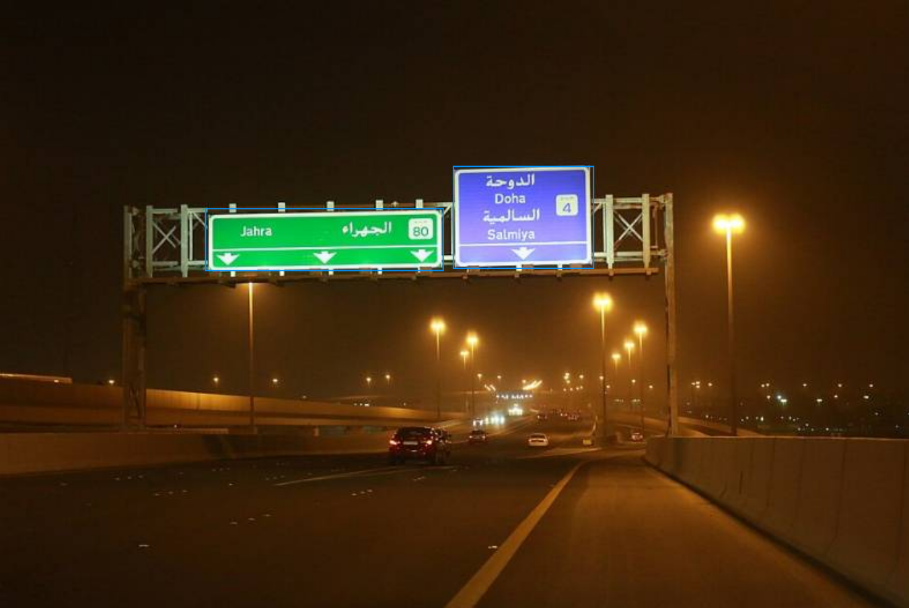

# Annotation guideline: Hướng dẫn gán nhãn phân tầng và phát hiện hộp bao biển báo giao thông — GTSDB

**Version:** v3 (Bản chuyển giao hoàn thiện sau Blind Handoff Test với Team 01)

> [!TIP]
> **Bản trực quan hóa tương tác (HTML Visual Guide):** Người gán nhãn hoặc nhóm peer có thể mở file [guideline_visualizer_v2.3.html](file:///home/dp/Documents/projects/team10team/K4-L2-DAY09-Road-Elements-Lab-Student-VuongTuanDuong-2A202602046/guideline-challenge/project/guideline_visualizer_v2.3.html) bằng trình duyệt web (Chrome/Edge) để xem minh họa trực quan:
> - **Bộ Tứ Vàng Bounding Box** & so sánh trực quan Loose / Clipped / Snug fit.
> - **Mô-đun Đo Kích Thước Đặc Trưng L** tương tác (tính toán tự động từ ảnh kéo thả hoặc nhập tọa độ).
> - **Ma trận Occluded vs Truncated** & **Quy chuẩn 4 trường hợp loại trừ nhiễu nghiêm ngặt**.
> - **Sơ đồ góc nhìn Hướng hiệu lực (relevance)** và phòng chống Phanh Oan (**Phantom Braking**).
> - **Gallery 5 ca mẫu thực tế** được kiểm duyệt từ `images/guideline-images/`.
> - **Bộ công cụ tính IoU Simulator**, **Checklist 8 điểm vàng** và **Bài trắc nghiệm thực hành 5 tình huống**.

---

### Thông tin dự án & Phân công trách nhiệm (Team 09)

- **Đơn vị thực hiện:** Team 09 (Thử thách Guideline Design Challenge — Day 09)
- **Đối tác Peer Review / Blind Test:** Team 01 (Nhóm peer test bài của Team 09 và Team 09 test bài của Team 01)
- **Problem Family:** Traffic sign taxonomy (Phân tầng biển báo đường bộ phục vụ xe tự hành)
- **Nguồn dữ liệu:** Bộ dữ liệu chuẩn `gtsdb` (German Traffic Sign Detection Benchmark — 28 ảnh độ phân giải cao $1360 \times 800$), có mở rộng liên kết bối cảnh `lisa` và `bdd100k` theo hợp đồng bài toán.
- **Bảng phân vai và đầu mối liên hệ kỹ thuật:**
  - **Spec Owner:** Phạm Hữu Hải (`01_problem_statement.md`, `00_team.md`) — Phụ trách hợp đồng downstream contract và ràng buộc an toàn ADAS.
  - **Guideline Owner:** Nguyễn Tú Anh (`02_guideline.md`) — Tác giả và chịu trách nhiệm nội dung quy chuẩn gán nhãn v2 / v2.3.
  - **CVAT & Data Owner:** Vương Tuấn Dương (`03_cvat_labels.json`, `03_ontology_and_cvat_setup.md`, `sample_pack.csv`, `09_cvat_export_or_task_reference.txt`) — Cấu hình schema CVAT và quản trị dataset.
  - **Gold & Edge-case Owner:** Ngô Duy Ngọc (`04_edge_cases/edge_case_cards.md`, `04_edge_cases/gold_decisions.csv`) — Quản lý thư viện ca biên và tập quyết định chuẩn vàng.
  - **QA & Blind Handoff Owner:** Phạm Xuân Duy (`05_qa_plan.md`, `06_calibration_report.csv`, `07_blind_handoff/`, `08_revision_log.md`) — Kiểm soát chất lượng, đo lường bất đồng calibration và điều phối bàn giao blind test.

---

## 1. Objective + scope

### 1.1 Mục tiêu kỹ thuật (Downstream Contract)
Dữ liệu gán nhãn từ guideline này phục vụ trực tiếp cho mô hình đa nhiệm **2-stage / Multitask Object Detection & Attribute Classification** (như YOLOv8/Faster R-CNN tích hợp Multi-attribute Classification Head). 

Đối tượng tiêu thụ dữ liệu hạ nguồn (Downstream Consumer) là **hệ thống điều khiển và lập kế hoạch hành trình ADAS L2+/L3 (Decision & Planning)**. Bounding box không chỉ đơn thuần xác định vị trí không gian (localization) mà các thuộc tính phân tầng (`sign_group`, `relevance`, `occlusion`, `legibility`) là đầu vào quyết định các hành vi tự lái sống còn: phát hiện biển dừng/cấm để dừng xe, nhận diện biển cảnh báo để giảm tốc độ, và phân tách biển quay lưng/đường phụ để triệt tiêu hiện tượng phanh gấp vô cớ (**phantom braking**).

### 1.2 Phạm vi gán nhãn (In-scope)
Bắt buộc vẽ bounding box và gán đầy đủ thuộc tính cho:
1. **Tất cả các biển báo giao thông chuẩn** thuộc hệ thống công ước Vienna (biển chuẩn Châu Âu trong GTSDB) hoặc hệ thống biển chuẩn Mỹ (trong tập đối sánh mở rộng): biển cấm, biển dừng, biển cảnh báo nguy hiểm, biển hiệu lệnh, biển chỉ dẫn, biển ưu tiên.
2. **Biển báo phụ (supplementary plate):** Các tấm biển phụ dạng hình chữ nhật gắn độc lập bên dưới biển chính, bổ sung thông tin cự ly, thời gian, hoặc loại phương tiện áp dụng.
3. **Hình thức lắp đặt:** Biển gắn trên cọc kim loại ven đường, treo trên giá long môn (overhead gantry), gắn trên dải phân cách hoặc rào chắn công trường.
4. **Trạng thái quan sát:** Biển nguyên vẹn hoặc bị che khuất một phần ($< 80\%$), biển nghiêng do góc chụp camera, biển bị lóa/mờ nhẹ nhưng con người vẫn nhận diện được viền và hình khối.
5. **Kích thước tối thiểu:** Kích thước cạnh dài nhất $L = \max(w, h) \ge 12 \text{ px}$ (tính theo tọa độ pixel thực tế của ảnh gốc $1360 \times 800$).

### 1.3 Ngoại vi phạm vi (Out-of-scope / IGNORE)
Tuyệt đối **KHÔNG** tạo bounding box (`IGNORE`) đối với:
1. **Đối tượng quá nhỏ:** Biển báo có $L = \max(w, h) < 12 \text{ px}$ trên ảnh gốc, không đủ điểm ảnh để xác định viền ngoài đáng tin cậy.
2. **Cơ cấu nâng đỡ và hạ tầng phụ:** Cột cọc, giá long môn, khung treo biển, dây cáp, bóng đổ của biển hoặc quầng sáng lóa (halo/flare).
3. **Mặt sau của biển quay 180° trơn nhẵn:** Mặt sau hoàn toàn của biển báo (mặt phẳng kim loại/xám không có viền phản quang, không có nội dung).
4. **Biển hiệu phi giao thông:** Bảng quảng cáo thương mại, số nhà, biển tên trạm xăng dầu, pano áp phích ven đường.
5. **Hình in giả lập (Decal):** Biển báo dán/in trên thân xe tải, xe buýt, áo phản quang của người đi bộ hoặc rào chắn tạm không có chức năng báo hiệu giao thông.
6. **Thành phần hạ tầng giao thông khác:** Đèn tín hiệu giao thông (traffic light), vạch kẻ đường, cọc tiêu mềm, gờ giảm tốc.

---

## 2. Annotation unit

- **Quy cách hình học:** Sử dụng công cụ **Shape / Rectangle** (hình chữ nhật có các cạnh song song với trục ảnh $x, y$). Tuyệt đối **không dùng Track** (do tập ảnh GTSDB gồm các ảnh tĩnh độc lập).
- **Nguyên tắc phân rã Instance (1-Object-1-Box):**
  - Mỗi mặt biển vật lý độc lập là **đúng 1 instance** `traffic_sign`.
  - **Cụm biển lắp chung một cột:** Nếu một cột có 2 hoặc 3 biển báo xếp chồng lên nhau (ví dụ: Biển cấm vượt ở trên, Biển phụ cự ly ở dưới), annotator phải vẽ **từng box riêng biệt** cho từng mặt biển. Nghiêm cấm vẽ 1 box to bao trùm toàn bộ cột hoặc gộp nhiều biển thành một.
  - **🔴 EDGE CASE ĐẶC BIỆT — BIỂN Ở XA CÓ 2 MÀU KHÁC NHAU:**
    - Khi quan sát ở cự ly xa, một cột biển thường xuất hiện dưới dạng một cụm nhỏ gồm **2 dải màu sắc/hình khối khác biệt xếp chồng theo trục dọc** (ví dụ: đốm màu đỏ/vàng của biển cấm/cảnh báo ở trên, và đốm màu trắng/xanh của biển phụ hoặc biển hiệu lệnh ở dưới).
    - **Quy tắc bắt buộc:** Dù ở xa kích thước hiển thị rất nhỏ (mỗi mảng chỉ từ $12\text{ px}$ đến $18\text{ px}$), annotator **BẮT BUỘC PHẢI GÁN 2 BOUNDING BOX RIÊNG BIỆT**, một box cho mảng màu phía trên và một box cho mảng màu phía dưới.
    - **Cấm gộp box:** Tuyệt đối **KHÔNG** vẽ 1 box to bao trùm cả 2 mảng màu, vì sẽ làm sai hoàn toàn tỷ lệ khung hình $(w/h)$ của mặt biển và làm hỏng đầu ra phân loại thuộc tính của downstream model.
    - **Cấm bỏ sót biển dưới:** Tuyệt đối **KHÔNG** chỉ vẽ biển màu đỏ phía trên mà bỏ quên biển màu trắng/xanh phía dưới.
  - **Biển có nhiều thông tin trên cùng một tấm mặt:** Nếu một tấm biển kim loại duy nhất chứa nhiều biểu tượng hoặc chữ viết, chỉ vẽ **1 bounding box duy nhất** bao trọn toàn bộ tấm biển đó.
  - **Biển bị vật cản cắt ngang (occlusion split):** Nếu một mặt biển bị cành cây, dây điện hoặc cột đèn chắn ngang chia mặt biển thành 2 phần nhìn thấy tách rời, annotator vẽ **1 bounding box duy nhất** bao phủ toàn bộ vùng biên ngoài của mặt biển (box chấp nhận chứa vật cản ở phần giữa). Không tách thành 2 box nhỏ.
  - **Không liên kết định danh (No tracking):** Mỗi ảnh được gán độc lập; cùng một biển xuất hiện ở các ảnh khác nhau vẫn được gán như các instance mới, không liên kết ID giữa các ảnh.

---

## 3. Geometry rule

### 3.1 Bộ Tứ Vàng Bounding Box (The 4 Golden Pillars)
Một box chuẩn trong thị giác máy tính và xe tự hành phải bảo đảm đầy đủ 4 tiêu chí cốt lõi:

1. **Ôm sát mép biển (Tightness):** Box vừa khít 4 mép ngoài cùng của mặt biển.
   - *Tránh:* Không lấy cọc sắt, không lấy nền trời hay bóng đổ, và không cắt lẹm viền phản quang của biển.
   - **So sánh 3 mức độ ôm khít:**
     - ❌ **Sai - Hộp quá rộng (Loose):** Box vẽ rộng ra ngoài, ôm cả cọc sắt đỡ biển và tán cây/nền trời $\rightarrow$ Khiến model học nhầm background là đặc trưng của biển báo.
     - ❌ **Sai - Hộp bị lẹm (Clipped):** Box vẽ quá nhỏ, cắt cụt mất viền đỏ hoặc một phần chữ số $\rightarrow$ Làm mất đặc trưng nhận diện hình khối và kích thước thực.
     - ✅ **Đúng - Ôm khít chuẩn (Snug Fit):** Box ôm vừa khít 4 điểm cực trị ngoài cùng của mặt biển vật lý, dừng chính xác tại điểm tiếp giáp với cọc đỡ $\rightarrow$ Chuẩn xác 100%!
2. **Mỗi biển 1 box riêng (Atomicity — 1 Biển = 1 Box):** Mỗi mặt biển báo là một box độc lập, kể cả khi 2-3 biển gắn chung một cột hoặc biển chính kèm biển phụ.
   - *Tránh:* Tuyệt đối không vẽ 1 box to gộp nhiều biển vào nhau.
3. **Giới hạn trong ảnh (Boundary Clamping):** Box nằm trọn vẹn trong vùng ảnh hợp lệ ($0 \le x \le 1360, 0 \le y \le 800$).
   - *Tránh:* Nếu biển nằm ở mép ảnh và bị cắt cụt (truncated), cạnh của box bắt buộc dừng chính xác tại rìa ảnh. Tuyệt đối không suy đoán vẽ tràn ra ngoài vùng ảnh.
4. **Thấy rõ mới vẽ (Visual Evidence — Rõ nét $\ge 12\text{px}$):** Chỉ vẽ box khi mắt người nhìn rõ hình khối biển báo và thỏa mãn kích thước đặc trưng $L \ge 12\text{ px}$.
   - *Tránh:* Không đoán mò; nếu nghi ngờ viền nhòe hoặc không chắc chắn thì đánh dấu `escalate_review = true`.

---

### 3.2 Quy chuẩn 3 ngưỡng kích thước đặc trưng $L = \max(w, h)$ & Quyết định gán nhãn
Kích thước được đo đạc trực tiếp trên hệ tọa độ pixel của ảnh gốc ($1360 \times 800$):
$$\text{Chiều rộng: } w = x_{max} - x_{min}$$
$$\text{Chiều cao: } h = y_{max} - y_{min}$$
$$\text{Kích thước đặc trưng: } L = \max(w, h)$$

| Ngưỡng kích thước $L$ | Phân loại đối tượng | Quyết định gán nhãn | Quy cách thao tác trên CVAT |
|---|---|---|---|
| **$L \ge 30\text{ px}$** | Biển lớn / trung bình | **BẮT BUỘC GÁN (`LABEL`)** | Vẽ bounding box chuẩn ôm khít viền biển; chọn đầy đủ 5 thuộc tính; dung sai cạnh $\le 3.0\text{ px}$. |
| **$12 \le L < 30\text{ px}$** | Biển nhỏ / ở xa | **GÁN NẾU RÕ KHỐI (`LABEL`)** | Vẽ bounding box cẩn thận; gán `legibility = unreadable` nếu không đọc được chữ số bên trong; dung sai cạnh $\le 1.5\text{ px}$. |
| **$L < 12\text{ px}$** | Quá nhỏ / thiếu bằng chứng | **BỎ QUA (`IGNORE`)** | Tuyệt đối **không vẽ box**. Bỏ qua để tránh đưa nhiễu hạt vào tập dữ liệu huấn luyện. |

---

### 3.3 Ngưỡng dung sai kiểm định chất lượng (QA Geometry Tolerance)
Được chuẩn hóa theo ràng buộc kỹ thuật tại `01_problem_statement.md` và kiểm định qua công cụ IoU Simulator:

| Tiêu chí kiểm định QA | Biển lớn ($L \ge 30\text{ px}$) | Biển nhỏ ($12 \le L < 30\text{ px}$) | Ý nghĩa kỹ thuật |
|---|---|---|---|
| **Chỉ số IoU (Intersection over Union)** | **$\text{IoU} \ge 0.85$** | **$\text{IoU} \ge 0.85$** | Tỷ lệ diện tích giao trên diện tích hợp giữa Box Annotator và Box Gold Reference. |
| **Độ lệch cạnh tuyệt đối ($\Delta$)** | **$\le 3.0\text{ px}$** mỗi cạnh | **$\le 1.5\text{ px}$** mỗi cạnh | $|\Delta x_{min}|, |\Delta y_{min}|, |\Delta x_{max}|, |\Delta y_{max}|$ đo độ dịch chuyển biên. |
| **Lệch tâm (Center Shift)** | **$\le 2.0\text{ px}$** | **$\le 1.0\text{ px}$** | Độ lệch tâm hình học $\sqrt{\Delta x_c^2 + \Delta y_c^2}$ tránh box bị lệch trọng tâm. |

*Lưu ý thẩm định:* Trong quá trình chấm chéo Blind Test, bất kỳ bounding box nào vi phạm một trong các ngưỡng trên đều bị tính là **1 Geometry Defect**.

---

## 4. Taxonomy & Schema định nghĩa

Hệ thống nhãn và thuộc tính tuân thủ tuyệt đối theo `03_cvat_labels.json` và `03_ontology_and_cvat_setup.md`.

### 4.1 Danh mục thực thể (Classes & Tags)
1. **Object Class:** `traffic_sign` (Geometry: `rectangle`) — Áp dụng cho mọi instance biển báo hợp lệ trong phạm vi.
2. **Image Tag:** `image_escalate` (Geometry: `tag`) — Nhãn gán mức độ toàn ảnh khi bức ảnh bị lỗi tệp tin, nhòe chuyển động toàn cảnh hoặc chứa ca bất định nghiêm trọng cần hoãn thẩm định.

### 4.2 Chi tiết thuộc tính của `traffic_sign` (Attributes)

| Tên Attribute | Kiểu nhập | Các giá trị cho phép | Giá trị mặc định | Định nghĩa & Tiêu chuẩn nhận diện trực quan |
|---|---|---|---|---|
| `sign_group` | select | `__undefined__`<br>`prohibitory`<br>`warning`<br>`mandatory`<br>`other_info`<br>`unknown` | `__undefined__` | **Nhóm chức năng của biển báo:**<br>• `prohibitory`: Biển cấm/dừng. Hình tròn viền đỏ nền trắng/xanh; hình bát giác đỏ (STOP); tam giác ngược viền đỏ (Yield/Nhường đường). Ví dụ: Cấm quay đầu, Cấm đi ngược chiều, Giới hạn tốc độ.<br>• `warning`: Biển nguy hiểm/cảnh báo. Hình tam giác đều viền đỏ đỉnh hướng lên nền vàng/trắng (Vienna); hoặc hình thoi vàng viền đen (chuẩn Mỹ). Ví dụ: Khúc cua nguy hiểm, Công trường, Giao nhau với đường ưu tiên.<br>• `mandatory`: Biển hiệu lệnh. Hình tròn nền xanh lam với mũi tên/biểu tượng màu trắng chỉ hướng đi bắt buộc, làn xe buýt, tốc độ tối thiểu.<br>• `other_info`: Biển chỉ dẫn & biển phụ. Biển thông tin làn đường, biển tên đường, biển hình thoi vàng viền trắng (Priority Road), và tất cả các biển phụ hình chữ nhật gắn dưới biển chính.<br>• `unknown`: Mặt trước của biển bị suy giảm chất lượng nặng, bạc màu hoặc lóa sáng đến mức không thể xếp vào 4 nhóm trên dù vẫn thấy rõ viền biển. |
| `relevance` | select | `__undefined__`<br>`facing_ego`<br>`facing_away`<br>`lateral` | `__undefined__` | **Hướng hiệu lực tác động tới xe tự hành (Ego vehicle):**<br>• `facing_ego`: Biển hướng thẳng hoặc lệch góc $< 60^\circ$ vào tầm nhìn của xe Ego $\rightarrow$ **ADAS tiếp nhận & xử lý tức thời**.<br>• `facing_away`: Biển quay lưng (mặt trước xoay góc $> 90^\circ$ so với hướng di chuyển của xe mình, ví dụ biển của luồng giao thông chiều ngược lại hoặc nhìn thấy mặt sau) $\rightarrow$ **Bỏ qua, không tác động tới Ego**.<br>• `lateral`: Biển hướng vuông góc ($\sim 90^\circ$) sang làn đường nhánh, đường gom song song hoặc đường giao cắt $\rightarrow$ **Tuyệt đối không phanh trên làn chính (Chống Phanh Oan - Phantom Braking)**. |
| `occlusion` | select | `none`<br>`partial`<br>`heavy` | `none` | **Mức độ che khuất bề mặt hiển thị của biển:**<br>• `none`: Mặt biển hiển thị hoàn chỉnh hoặc bị che $< 10\%$ diện tích.<br>• `partial`: Bị che khuất từ $10\%$ đến $50\%$ (ví dụ cành cây, cột đèn, phương tiện khác che một góc nhưng vẫn nhận dạng rõ hình học/nội dung).<br>• `heavy`: Bị che khuất từ $> 50\%$ đến $80\%$ diện tích (mặt biển bị che phần lớn nhưng vẫn còn bằng chứng tin cậy để nhận diện). *Ghi chú: Nếu bị che $> 80\%$, xem xét IGNORE hoặc Escalate.* |
| `legibility` | select | `legible`<br>`unreadable` | `legible` | **Khả năng đọc hiểu nội dung/ký hiệu:**<br>• `legible`: Khi zoom ảnh gốc, mắt người bình thường có thể đọc rõ chữ số, mũi tên hoặc biểu tượng bên trong biển.<br>• `unreadable`: Biển bị mờ do độ phân giải thấp, nhòe chuyển động (motion blur), hoặc chói sáng khiến không thể đọc được nội dung chi tiết bên trong, dù vẫn nhận dạng được hình khối biển báo. |
| `escalate_review` | checkbox | `false`<br>`true` | `false` | **Đánh dấu ca khó cần hội chẩn:**<br>• `false`: Quyết định gán nhãn đã chắc chắn.<br>• `true`: Đánh dấu khi annotator gặp ca biên phân vân (viền mờ, không rõ nhóm chức năng, góc xoay ranh giới giữa `facing_ego` và `lateral`) cần Reviewer/Team Lead xử lý. |

> [!CRITICAL]
> **Cơ chế chống thiên kiến (Anti-Bias Design):**
> Hai thuộc tính `sign_group` và `relevance` bắt buộc cấu hình mặc định là `__undefined__`. Annotator phải chủ động click chọn giá trị tương ứng cho từng box. Bất kỳ box nào xuất file còn sót giá trị `__undefined__` sẽ bị hệ thống QA chấm **Lỗi nặng (Major Defect)** và từ chối nghiệm thu.

---

## 5. Inclusion / exclusion matrix

### 5.1 Ma trận tra cứu nhanh quyết định gán nhãn

| Ngữ cảnh quan sát | Kích thước & Điều kiện | Quyết định (Decision) | Thao tác trên CVAT |
|---|---|---|---|
| Biển chuẩn, rõ nét, viền xác định | $L \ge 12 \text{ px}$ | **LABEL** | Vẽ rectangle `traffic_sign`, chọn `sign_group`, `relevance`, `occlusion = none`, `legibility = legible`. |
| Biển bị mờ/xa nhưng nhận diện được nhóm | $L \ge 12 \text{ px}$ | **LABEL** | Vẽ rectangle, chọn đúng nhóm biển, chọn `legibility = unreadable`. |
| Cột có nhiều biển báo xếp dọc | Mỗi biển $L \ge 12 \text{ px}$ | **LABEL riêng** | Vẽ từng rectangle cho từng mặt biển riêng biệt. |
| **Cụm biển ở xa có 2 màu khác nhau (đốm đỏ trên, đốm trắng/xanh dưới)** | Kích thước nhỏ ($L \approx 12 - 18\text{ px}$) | **LABEL 2 box riêng** | **Bắt buộc vẽ 2 rectangle riêng biệt** ôm sát từng dải màu; gán box trên là `prohibitory`/`warning`, box dưới là `other_info`/`mandatory`. Tuyệt đối không gộp 1 box. |
| Biển phụ hình chữ nhật gắn dưới biển chính | $L \ge 12 \text{ px}$ | **LABEL** | Vẽ rectangle riêng, gán `sign_group = other_info`. |
| Biển cấm ở đường gom/nhánh rẽ | $L \ge 12 \text{ px}$ | **LABEL** | Vẽ rectangle, chọn `sign_group = prohibitory`, chọn `relevance = lateral`. |
| Biển cấm ở làn ngược chiều (ngoảnh mặt đi) | Thấy viền trước/nghiêng | **LABEL** | Vẽ rectangle, chọn `relevance = facing_away`. |
| Mặt sau biển quay trơn nhẵn $180^\circ$ | Không thấy viền trước | **IGNORE** | Không vẽ box. |
| Biển quá xa hoặc quá nhỏ | $L < 12 \text{ px}$ | **IGNORE** | Không vẽ box. |
| Biển quảng cáo, trạm xăng, số nhà | Mọi kích thước | **IGNORE** | Không vẽ box. |
| Đèn giao thông, cọc tiêu, vạch kẻ đường | Mọi kích thước | **IGNORE** | Không vẽ box. |
| Biển bị che $> 80\%$ không còn hình thù | Mọi kích thước | **IGNORE** | Không vẽ box. |
| Nghi ngờ là biển nhưng viền quá nhòe | $L \ge 12 \text{ px}$ | **ESCALATE** | Vẽ rectangle, chọn `sign_group = unknown`, tick `escalate_review = true`. |
| Toàn bộ frame ảnh bị hỏng/đen/chói lóa | Toàn ảnh | **TAG ESCALATE** | Chọn công cụ Tag trên thanh công cụ CVAT $\rightarrow$ gán nhãn `image_escalate`. |

---

### 5.2 Quy chuẩn loại trừ nhiễu nghiêm ngặt (Strict Noise Exclusions)
Hệ thống thị giác máy tính rất dễ bị đánh lừa bởi các hình ảnh giả lập (False Positives). Annotator tuyệt đối tuân thủ 4 quy chuẩn loại trừ sau:

1. 🚌 **Decal / Tem in trên thân xe (Vehicle Decals) $\rightarrow$ IGNORE:**
   - *Hiện tượng:* Biển hạn chế tốc độ "60" hoặc cảnh báo dán sau đuôi xe tải, xe buýt, xe bồn.
   - *Nguy cơ:* Nếu vẽ box, mô hình downstream sẽ nhận nhầm chiếc xe tải thành một cột biển báo tĩnh, làm mất dấu phương tiện dẫn đường (Lead Vehicle Tracking Failure)!
   - *Hành động:* Tuyệt đối **IGNORE**, không vẽ box.
2. 🪞 **Ảnh phản chiếu ảo (Reflections) $\rightarrow$ IGNORE:**
   - *Hiện tượng:* Hình ảnh biển báo phản chiếu trên nắp ca-pô bóng lóa, vũng nước mưa trên mặt đường hoặc mặt kính tòa nhà ven đường.
   - *Nguy cơ:* Ảnh ảo không phải thực thể 3D trong không gian, làm sai lệch ước lượng chiều sâu của cảm biến.
   - *Hành động:* Tuyệt đối **IGNORE**, chỉ gán nhãn biển vật lý thực thụ.
3. ☀️ **Bóng đổ & Quầng sáng lóa (Cast Shadows & Sun Glare / Halo) $\rightarrow$ KHÔNG LẤY VÀO BOX:**
   - *Hiện tượng:* Chụp ngược sáng tạo quầng sáng rực rỡ (halo/flare) loang ra tán cây, hoặc bóng cây/bóng cột biển đổ dài xuống mặt đường.
   - *Hành động:* Bounding box chỉ đóng khung phần mép vật lý của mặt biển, **không mở rộng box để ôm quầng sáng hoặc bóng đổ**.
4. 🚦 **Đèn tín hiệu & Hạ tầng phụ (Non-Sign Infrastructure) $\rightarrow$ IGNORE:**
   - *Hiện tượng:* Đèn tín hiệu giao thông (xanh - vàng - đỏ), camera phạt nguội, cọc tiêu mềm, rào chắn công trường, biển tên đường nhỏ gắn số nhà, biển quảng cáo thương mại.
   - *Hành động:* Thuộc scope của bài toán khác, **IGNORE** toàn bộ đối với nhãn `traffic_sign`.

---

## 6. Visibility, occlusion & edge conditions

### 6.1 Ma trận phân biệt: Che khuất (Occluded) vs Cắt mép (Truncated)
Việc phân biệt rõ giữa vật thể bị che chắn trong không gian 3D (In-scene Occlusion) và vật thể bị cắt bởi trường nhìn camera (FOV Truncation) là cực kỳ quan trọng cho mô hình dự báo chuyển động:

```
+---------------------------------------------------------------------------------------------------------+
|                                    OCCLUDED VS TRUNCATED MATRIX                                         |
+--------------------------+------------------------------------------------------------------------------+
| 1. Fully Visible         | - Biển trọn vẹn trong khung hình, diện tích bị che < 10%.                    |
|    (Bình thường)         | - Gán nhãn: occlusion = none. Box ôm sát 4 mép ngoài.                        |
+--------------------------+------------------------------------------------------------------------------+
| 2. Occluded (In-scene)   | - Vật thể trong cảnh (cành cây, cột đèn, xe khác) che một phần mặt biển.     |
|    (Bị che khuất)        | - Quy cách: Vẽ 1 box bao trọn hình khối chuẩn của mặt biển (chấp nhận        |
|                          |   chứa cành cây ở giữa). CẤM cắt lẹm viền và CẤM tách thành 2 box vụn!       |
|                          | - Gán nhãn: occlusion = partial (10% - 50%) hoặc heavy (> 50% - 80%).        |
+--------------------------+------------------------------------------------------------------------------+
| 3. Truncated             | - Biển nằm ở rìa bức ảnh và bị cắt bởi biên camera.                          |
|    (Cắt mép ảnh)         | - Quy cách: Cạnh box BẮT BUỘC DỪNG CHÍNH XÁC tại rìa ảnh (x=0, x=1360,       |
|                          |   y=0, y=800). CẤM vẽ đoán tràn ra ngoài khung ảnh!                          |
+--------------------------+------------------------------------------------------------------------------+
| 4. Occluded + Truncated  | - Biển ở sát rìa ảnh đồng thời bị cành cây/cột che khuất một phần.           |
|    (Vừa che vừa cắt)     | - Quy cách: Clamp tại mép ảnh; tính tỷ lệ che trên phần diện tích nhìn thấy. |
+--------------------------+------------------------------------------------------------------------------+
```

---

### 6.2 Hướng hiệu lực (relevance) & Phòng chống Phanh Oan (Phantom Braking)
Hệ thống tự hành L2+/L3 phân tích góc quay mặt biển để quyết định quyền điều khiển xe:

1. 🟢 **`facing_ego` (Hướng thẳng vào xe mình):**
   - *Đặc điểm:* Mặt trước của biển vuông góc hoặc lệch góc $< 60^\circ$ hướng thẳng vào tầm nhìn của xe Ego trên làn đường đang chạy.
   - *Tác động ADAS:* Hệ thống ra quyết định tiếp nhận và lập tức đọc giá trị biển báo để điều khiển xe (ví dụ giảm tốc độ về 60 km/h).
   - *Áp dụng:* Mọi biển hiệu lệnh, cấm, cảnh báo ở lề phải hoặc giá long môn của làn xe mình.
2. ⚪ **`facing_away` (Quay lưng / Làn đối diện):**
   - *Đặc điểm:* Mặt trước của biển xoay góc $> 90^\circ$ so với hướng di chuyển của xe mình (ví dụ biển của làn đường ngược chiều hoặc chỉ nhìn thấy mặt sau).
   - *Tác động ADAS:* Bỏ qua không tác động tới điều khiển xe. Ngăn ngừa nhận nhầm biển cấm của chiều kia.
   - *Chú ý:* Nếu mặt sau trơn nhẵn $180^\circ$ không thấy viền/hình $\rightarrow$ `IGNORE` (không vẽ box).
3. 🟡 **`lateral` (Đường gom / Nhánh rẽ):**
   - *Đặc điểm:* Biển hướng mặt vuông góc ($\sim 90^\circ$) sang đường giao cắt, đường gom song song hoặc nhánh rẽ tách làn.
   - *Tác động ADAS:* Tuyệt đối không phanh xe trên làn chính. Chỉ áp dụng nếu xe kích hoạt xi-nhan rẽ sang nhánh đó.
   - *Trọng yếu:* **Nhầm `lateral` thành `facing_ego` gây lỗi Phantom Braking cực kỳ nguy hiểm!**

---

### 6.3 Edge case đặc thù: Biển ở xa có 2 màu khác nhau (Distant Two-Color Stacked Signs)
- **Hiện tượng quang học:** Ở cự ly xa (> 50 mét), cột biển gồm 1 biển chính ở trên (viền đỏ/vàng) và 1 biển phụ ở dưới (trắng/xanh) bị nén phối cảnh telephoto, kích thước mỗi biển chỉ đạt từ $12\text{ px}$ đến $18\text{ px}$. Mắt thường nhìn lướt qua dễ nhầm là 1 vật thể duy nhất có 2 màu hoặc chỉ vẽ đốm đỏ mà quên đốm trắng.
- **Quy tắc bắt buộc (Mandatory Dual-Box Rule):**
  1. Khi zoom ảnh $100\%$ pixel gốc thấy 2 khối màu độc lập xếp chồng theo trục dọc: **BẮT BUỘC PHẢI TẠO 2 BOUNDING BOX RIÊNG BIỆT**.
  2. **Box 1 (phía trên):** Ôm trọn mảng màu đỏ/vàng của biển chính $\rightarrow$ `sign_group = prohibitory` (hoặc `warning`), `relevance = facing_ego`, `legibility = unreadable`.
  3. **Box 2 (phía dưới):** Ôm trọn mảng màu trắng/xanh của biển phụ $\rightarrow$ `sign_group = other_info` (hoặc `mandatory`), `relevance = facing_ego`, `legibility = unreadable`.
  4. Hai box tiếp giáp nhau tại vạch phân cách màu sắc, độ chồng lấn $\le 1\text{ px}$. Tuyệt đối không gộp 1 box và không bỏ quên biển dưới.

---

## 7. Ambiguity, escalation & Downstream Critical Risks

### 7.1 Hai Lỗi Chí Mạng Trong Xe Tự Hành (Safety-Critical Failures)
Căn cứ tiêu chuẩn an toàn ISO 26262 và SOTIF trong hợp đồng Downstream Contract:

```
+----------------------------------------------------------------------------------------------------+
|                                    SAFETY-CRITICAL RISK MATRIX                                     |
+----------------------------------------------------------------------------------------------------+
| 💥 CRITICAL 1: BỎ SÓT BIỂN AN TOÀN (False Negative ở facing_ego)                                   |
|    - Hành vi sai phạm: Annotator bỏ sót không vẽ box, gán nhãn IGNORE, hoặc phân loại sai          |
|      sign_group cho biển STOP, Biển Cấm đi ngược chiều, Biển Giới hạn tốc độ hoặc Biển Công        |
|      trường đang hướng thẳng về xe mình (facing_ego).                                              |
|    - Hậu quả thảm khốc: Xe tự hành lao qua giao lộ nguy hiểm với tốc độ cao mà không hãm          |
|      phanh, dẫn đến tai nạn trực diện nghiêm trọng!                                                |
+----------------------------------------------------------------------------------------------------+
| 🛑 CRITICAL 2: NHẦM HƯỚNG GÂY PHANH OAN (Phantom Braking - False Positive Relevance)               |
|    - Hành vi sai phạm: Gán nhầm relevance = facing_ego cho biển giới hạn tốc độ thấp (ví dụ       |
|      30-40 km/h) ở đường nhánh rẽ (lateral) hoặc biển của luồng xe ngược chiều (facing_away).      |
|    - Hậu quả thảm khốc: Xe tự hành đang chạy 100 km/h trên cao tốc bỗng nhiên phanh gấp khẩn cấp  |
|      vô cớ giữa đường, gây chuỗi tai nạn dồn toa thảm khốc từ các xe chạy phía sau!                |
+----------------------------------------------------------------------------------------------------+
```

---

### 7.2 Hệ thống Mã Issue Chuẩn (Issue Escalation Codes)
Khi gặp tình huống chưa chắc chắn, tuân thủ nguyên tắc **"Dừng suy đoán — Mở Issue leo thang"**:

| Mã Issue | Tên định danh | Tình huống kích hoạt | Hành động của Annotator |
|---|---|---|---|
| **ISSUE-01** | `UNCERTAIN_CLASS` | Thấy rõ viền hình khối nhưng họa tiết bên trong bị mờ/bạc màu/lóa sáng, không thể phân định giữa `prohibitory`, `warning` hay `other_info`. | Tạo box, chọn `sign_group = unknown`, tick `escalate_review = true`. |
| **ISSUE-02** | `UNCERTAIN_BOUNDARY` | Đối tượng bị nhòe chuyển động (motion blur) nặng hoặc chói đèn pha ban đêm làm tan biến 1 trong 4 cạnh, không thể định vị mép cực trị chính xác. | Tạo box ước lượng vùng rõ nhất, tick `escalate_review = true`. |
| **ISSUE-03** | `UNCERTAIN_SCOPE` | Nghi ngờ vật thể là pano quảng cáo, số nhà ven đường, biển trạm xăng tạm hoặc tem in phản quang trên áo công nhân. | Đánh dấu tick `escalate_review = true` kèm ghi chú nghi ngoài scope. |
| **ISSUE-04** | `ATTRIBUTE_CHECK` | Biển báo nằm ở góc xoay ranh giới nhạy cảm ($50^\circ - 70^\circ$) giữa `facing_ego` và `lateral`. | Tick `escalate_review = true` để Lead chốt góc tránh lỗi Phantom Braking. |

---

### 7.3 Quy trình Escalation 3 Bước
1. **Bước 1 (Annotator):** Tạo bounding box trên CVAT $\rightarrow$ gán `sign_group = unknown` (nếu không rõ loại) $\rightarrow$ tick checkbox `escalate_review = true` (hoặc gắn tag `image_escalate` nếu toàn bộ ảnh bị hỏng/đen).
2. **Bước 2 (Ghi nhận):** Ghi chép ngay mã `sample_id`, tọa độ box ước lượng và mã Issue vào biên bản review nội bộ (`clarification_log.csv`).
3. **Bước 3 (Phán quyết):** QA Owner (Phạm Xuân Duy) và Spec Owner (Phạm Hữu Hải) đưa ra quyết định chuẩn vàng dựa trên Downstream Safety Contract, văn bản hóa thành Edge-case Card và cập nhật vào guideline.

---

## 8. Temporal rule

- **Tập dữ liệu tĩnh GTSDB:** Hiện tại, thử thách Day 09 thực thi trên tập 28 ảnh tĩnh `gtsdb`. Mỗi bức ảnh là một bối cảnh độc lập.
- **Quy tắc:** Tuyệt đối không dùng tính năng Tracking của CVAT; không ngoại suy hoặc đoán nhận vị trí biển báo dựa trên chuỗi thời gian.
- **Mở rộng (khi làm việc với LISA Video):** Nếu mở rộng sang video clip liên tiếp 30 frames của LISA, mỗi cột biển là một `Track`, các thuộc tính hình thái như `occlusion` có thể chuyển thành `mutable` qua từng frame; khi xe chạy vượt qua biển và biển ra khỏi khung hình, annotator bắt buộc bấm phím **O** (Outside) để đóng track, tránh lỗi box kéo dài vô tận.

---

## 9. Concrete examples & Demo thực tế từ ảnh gán nhãn mẫu

### 9.1 Phân tích 5 ca gán nhãn mẫu thực tế từ `images/guideline-images/`

#### 📷 Case 1: Xử lý che khuất nặng (Heavy Occlusion) & Phân rã cụm biển
- **Tệp ảnh minh chứng:** [occu.png](../images/guideline-images/occu.png)
- **Bối cảnh hiện trường:** Tuyến đường đô thị có dải phân cách trồng hàng cây xanh rậm rạp. Camera quan sát thấy 3 biển báo ở các cự ly và trạng thái che khuất khác nhau.


- **Phân tích từng bounding box mẫu:**
  1. **Box 1 (Biển quay đầu xe chữ U to bên phải lề đường):**
     - *Quan sát:* Tấm biển hình vuông to bản màu xanh lam có mũi tên chữ U màu trắng rõ nét, không bị che khuất.
     - *Quy cách vẽ:* Bounding box ôm khít 4 cạnh viền ngoài màu xanh của tấm biển; dừng lại ngay trên điểm tiếp giáp với cọc sọc đỏ trắng (không bao trùm cọc).
     - *Thuộc tính:* `sign_group = mandatory` (hoặc `other_info`), `relevance = facing_ego`, `occlusion = none`, `legibility = legible`, `escalate_review = false`.
  2. **Box 2 (Biển cấm dừng đỗ tròn đỏ-xanh bị cành cây che khuất nặng ở giữa - CA MẪU MỰC):**
     - *Quan sát:* Biển tròn viền đỏ nền xanh cấm đỗ/dừng xe bị thân cây và tán lá che chắn gần một nửa diện tích mặt biển (phần giữa và góc trên bị cành lá đè lên).
     - *Quy cách vẽ:* **Bắt buộc vẽ 1 bounding box hình chữ nhật bao trọn toàn bộ hình tròn vật lý nhìn thấy của biển** (box chấp nhận chứa cành cây và kẽ lá ở phần giữa). Tuyệt đối **không** lẹm mép box vào trong để tránh lá cây, và **không** tách thành 2 box vụn hai bên!
     - *Thuộc tính:* `sign_group = prohibitory`, `relevance = facing_ego`, `occlusion = heavy` (do bị che $> 50\%$), `legibility = legible` (vẫn nhận dạng được hình họa cấm đỗ), `escalate_review = false`.
  3. **Box 3 (Biển người đi bộ qua đường ở cự ly xa bên lề trái):**
     - *Quan sát:* Biển vuông màu xanh có biểu tượng tam giác người đi bộ gắn trên cọc ở xa hơn.
     - *Thuộc tính:* `sign_group = other_info` (hoặc `warning`), `relevance = facing_ego`, `occlusion = none`, `legibility = legible`.
- **💡 Bài học cốt lõi:** Khi gặp biển bị cây cối cắt ngang mặt: **"Giữ nguyên hình khối hình học chuẩn của mặt biển, vẽ 1 box bao trùm và đánh dấu `occlusion = partial` hoặc `heavy`"**.

---

#### 📷 Case 2: Cụm biển xếp chồng nhiều màu (Multi-color Stacked Signs) & Ánh sáng chói lóa
- **Tệp ảnh minh chứng:** [sang.png](../images/guideline-images/sang.png)
- **Bối cảnh hiện trường:** Ngã ba giao cắt ven rừng, ánh sáng ban ngày chiếu rọi cực mạnh tạo độ tương phản cao (High Dynamic Range / Sun Glare). Có 2 cụm biển xếp chồng ở hai bên đường và 1 biển chỉ dẫn ở hậu cảnh.


- **Phân tích từng bounding box mẫu:**
  1. **Cụm biển bên phải lề đường (Giao lộ dừng xe):**
     - *Box trên:* Biển bát giác đỏ **STOP** $\rightarrow$ Vẽ box ôm khít 8 cạnh bát giác. Gán: `sign_group = prohibitory`, `relevance = facing_ego`, `occlusion = none`, `legibility = legible`.
     - *Box dưới:* Biển phụ/chỉ dẫn hình chữ nhật màu xanh viền vàng gắn ngay bên dưới biển STOP $\rightarrow$ **Bắt buộc vẽ box thứ hai riêng biệt tiếp giáp khít với đáy biển STOP**. Gán: `sign_group = other_info`, `relevance = facing_ego`, `occlusion = none`, `legibility = legible`.
     - *Cấm kỵ:* Tuyệt đối không gộp biển STOP và biển chỉ dẫn thành 1 box to!
  2. **Cụm biển bên trái lề đường:**
     - *Box trên:* Biển bát giác đỏ **STOP** $\rightarrow$ Vẽ box riêng, `sign_group = prohibitory`, `relevance = facing_ego`.
     - *Box dưới:* Biển tròn nền xanh lam mũi tên trắng chỉ hướng đi bắt buộc $\rightarrow$ Vẽ box riêng, `sign_group = mandatory`, `relevance = facing_ego`.
  3. **Biển chỉ dẫn ở xa (Chính giữa ngã ba):**
     - Biển chữ nhật xanh chỉ hướng đường ở cự ly xa $\rightarrow$ Vẽ 1 box vừa vặn, gán `sign_group = other_info`, `relevance = facing_ego`, `legibility = unreadable` (do cự ly xa và ánh sáng chói làm mờ chữ bên trong).
- **💡 Bài học cốt lõi:** Một cột có 2 biển khác màu/khác nhóm thì **BẮT BUỘC gán 2 box riêng biệt tiếp giáp nhau**. Khi nắng chói lóa, chỉ lấy biên phản quang thực của mặt biển, không lấy quầng sáng loang ra tán cây xung quanh.

---

#### 📷 Case 3: Điều kiện ngược sáng / Hoàng hôn thiếu sáng (Low Light / Backlit Scene)
- **Tệp ảnh minh chứng:** [toi.png](../images/guideline-images/toi.png)
- **Bối cảnh hiện trường:** Đường cong nông thôn một làn xe trong điều kiện chiều muộn ngược sáng, bầu trời sáng nhưng mặt đường và cảnh vật ven đường chìm trong bóng tối.


- **Phân tích từng bounding box mẫu:**
  1. **Box 1 (Biển tam giác cảnh báo gắn trên cột điện bằng gỗ bên phải):**
     - *Quan sát:* Biển tam giác viền đỏ cảnh báo trượt tuyết gắn trực tiếp vào thân cột điện gỗ bên lề đường. 
     - *Quy cách vẽ:* Bounding box hình chữ nhật đóng khung chính xác 3 đỉnh ngoài cùng của tam giác. Cột điện gỗ đâm thẳng từ trên xuống dưới biển nhưng **box không bao trùm thân cột gỗ**, dừng sát mép tam giác.
     - *Thuộc tính:* `sign_group = warning`, `relevance = facing_ego`, `occlusion = none`, `legibility = legible`.
  2. **Box 2 (Biển nhỏ ở cự ly rất xa bên hông ngôi nhà phía xa):**
     - *Quan sát:* Một biển báo nhỏ gắn ở góc tường ngôi nhà bên lề trái đường cong. Dù khung cảnh bị tối nhưng zoom lên vẫn thấy viền hình học và thỏa mãn $L \ge 12 \text{ px}$.
     - *Thuộc tính:* `sign_group = other_info` (hoặc `warning`), `relevance = facing_ego`, `legibility = unreadable`, `escalate_review = false`.
- **💡 Bài học cốt lõi:** Ở điều kiện ánh sáng yếu, annotator phải kiên trì rà soát các cột điện và góc tường ven đường; không được lấy thân cọc gỗ vào box.

---

#### 📷 Case 4: Đô thị mùa đông phức tạp & Cành cây rụng lá chằng chịt (Complex Urban Scene)
- **Tệp ảnh minh chứng:** [hard.png](../images/guideline-images/hard.png)
- **Bối cảnh hiện trường:** Khu phố dân cư đô thị mùa đông, các hàng cây rụng lá tạo ra nhiều cành nhánh đan xen phức tạp vào nền trời và nhà cửa.


- **Phân tích từng bounding box mẫu:**
  1. **Box 1 (Biển cảnh báo gắn cạnh thân cây cổ thụ bên phải):**
     - *Quan sát:* Biển báo tam giác viền đỏ nằm trong khung bảo vệ vuông màu xanh gắn bên thân cây to. Box ôm sát toàn bộ mặt hiển thị nhìn thấy.
     - *Thuộc tính:* `sign_group = warning`, `relevance = facing_ego`, `occlusion = none`, `legibility = legible`.
  2. **Box 2 (Biển nhỏ ở xa bên lề trái ngã tư):**
     - *Quan sát:* Biển báo nhỏ cắm ở vỉa hè xa phía trước trạm xe buýt/tòa nhà. Đo pixel ảnh gốc đạt $L \ge 12 \text{ px}$.
     - *Thuộc tính:* `sign_group = other_info`, `relevance = facing_ego`, `legibility = unreadable`.
- **💡 Bài học cốt lõi:** Cành cây khô mùa đông dễ gây nhầm lẫn đường viền. Annotator phải zoom $100\%$ pixel gốc để phân biệt rõ đâu là nhánh cây đè lên và đâu là viền ngoài của biển; không vẽ nhầm vào bóng đổ của cây lên tường.

---

#### 📷 Case 5: Biển chỉ dẫn trên giá long môn ban đêm (Overhead Gantry at Night)
- **Tệp ảnh minh chứng:** [troitoi.png](../images/guideline-images/troitoi.png)
- **Bối cảnh hiện trường:** Cao tốc nhiều làn xe ban đêm, ánh sáng vàng từ hệ thống đèn cao áp. Có giá long môn bằng khung thép vắt ngang trên các làn xe, treo các biển chỉ dẫn kích thước lớn bằng vật liệu phản quang.



- **Phân tích từng bounding box mẫu:**
  1. **Box 1 (Biển chỉ dẫn bên trái - Nền xanh lá "Jahra 80"):**
     - *Quan sát:* Tấm biển hình chữ nhật nền xanh lá cây viền trắng chỉ hướng đi Jahra.
     - *Quy cách vẽ:* Bounding box hình chữ nhật đóng khung chính xác 4 mép viền ngoài cùng của tấm biển phản quang. **Không bao trùm khung giàn thép hay thanh đà của giá long môn**.
     - *Thuộc tính:* `sign_group = other_info`, `relevance = facing_ego`, `occlusion = none`, `legibility = legible`.
  2. **Box 2 (Biển chỉ dẫn bên phải - Nền xanh dương "Doha / Salmiya 4"):**
     - *Quan sát:* Tấm biển hình chữ nhật nền xanh lam gắn song song bên cạnh tấm biển Box 1 trên cùng giá treo.
     - *Quy cách vẽ:* **Bắt buộc tách thành box thứ 2 độc lập**, ôm sát 4 cạnh của tấm biển xanh dương.
     - *Thuộc tính:* `sign_group = other_info`, `relevance = facing_ego`, `occlusion = none`, `legibility = legible`.
  3. **Khung thép giàn giáo & Đèn cao áp:**
     - *Quy tắc:* Toàn bộ kết cấu khung giàn thép chịu lực và các bóng đèn chiếu sáng phía trên là hạ tầng phụ trợ $\rightarrow$ **IGNORE** (Tuyệt đối không vẽ box bao trùm cả giàn thép!).
- **💡 Bài học cốt lõi:** Khi gặp giá long môn trên cao tốc, mỗi tấm biển treo là một thực thể độc lập (`traffic_sign`). Không vẽ một "hộp bao khổng lồ" chứa cả giá long môn.

---

### 9.2 Các ví dụ bổ sung trích xuất từ dữ liệu GTSDB của nhóm

- **Ví dụ 1: Cụm biển xếp dọc nhiều tầng trên cùng một cột bên lề phải ([GTS01.png](file:///home/dp/Documents/projects/team10team/K4-L2-DAY09-Road-Elements-Lab-Student-VuongTuanDuong-2A202602046/guideline-challenge/data/gtsdb/GTS01.png)):**
  - Tách riêng Box 1 (biển cấm tròn `(723, 431) - (752, 457)`) và Box 2 (biển phụ chữ nhật `(724, 459) - (751, 474)`). Không lấy cọc sắt.
- **Ví dụ 2: Cụm biển cảnh báo kết hợp đèn tín hiệu giao thông ([GTS03.png](file:///home/dp/Documents/projects/team10team/K4-L2-DAY09-Road-Elements-Lab-Student-VuongTuanDuong-2A202602046/guideline-challenge/data/gtsdb/GTS03.png)):**
  - Vẽ Box 1 (biển tam giác cảnh báo `(1113, 436) - (1152, 473)`), Box 2 (biển tròn hiệu lệnh `(1117, 473) - (1146, 502)`). Giàn đèn tín hiệu giao thông $\rightarrow$ `IGNORE`.
- **Ví dụ 3: Biển báo nhỏ, xa tại khu vực công trường ([GTS07.png](file:///home/dp/Documents/projects/team10team/K4-L2-DAY09-Road-Elements-Lab-Student-VuongTuanDuong-2A202602046/guideline-challenge/data/gtsdb/GTS07.png)):**
  - Kiểm tra độ phân giải pixel gốc: nếu $L \ge 12\text{ px} \rightarrow$ `LABEL` (chọn `legibility = unreadable`); nếu $L < 12\text{ px} \rightarrow$ `IGNORE`.
- **Ví dụ 4: Biển bị che khuất một phần bởi cành cây ven đường ([GTS02.png](file:///home/dp/Documents/projects/team10team/K4-L2-DAY09-Road-Elements-Lab-Student-VuongTuanDuong-2A202602046/guideline-challenge/data/gtsdb/GTS02.png)):**
  - Vẽ 1 box bao trọn hình tròn nguyên bản của biển giới hạn tốc độ; gán `occlusion = partial`. Không cắt lẹm mép box để tránh tán cây.

---

## 10. Common mistakes & Annotator Checklist

### 10.1 Bảng phân tích các lỗi phổ biến và biện pháp khắc phục

| Mã lỗi | Tên lỗi thường gặp | Nguyên nhân gốc rễ | Hậu quả kỹ thuật | Biện pháp ngăn chặn bắt buộc |
|---|---|---|---|---|
| **E-01** | Gộp nhiều biển cùng cột vào 1 box | Annotator thao tác vội, lười tách box | Downstream model học sai kích thước biển, không phân loại được từng thuộc tính | Mỗi mặt biển vẽ 1 box riêng. Đếm số mặt biển trước khi vẽ. |
| **E-02** | Bỏ quên thuộc tính ở giá trị `__undefined__` | Do hệ thống đặt default là `__undefined__` để chống thiên kiến | Annotation xuất ra bị thiếu dữ liệu, vi phạm hợp đồng schema | Chuyển chế độ sang **Attribute Annotation** trên CVAT để kiểm tra từng box trước khi bấm Save. |
| **E-03** | Nhầm lẫn `facing_ego` với `lateral` hoặc `facing_away` | Không phân tích góc hiệu lực tới làn xe mình | **Lỗi chí mạng 2:** Gây ra phantom braking nguy hiểm khi xe phanh oan vì biển đường khác | Luôn tự hỏi: "Biển này có bắt buộc xe Ego phải tuân thủ ngay trên làn này không?". Nếu không $\rightarrow$ chọn `lateral` hoặc `facing_away`. |
| **E-04** | Bỏ sót biển cấm / cảnh báo nhỏ ($12 \le L < 20 \text{ px}$) | Mắt thường nhìn lướt không thấy | **Lỗi chí mạng 1:** Xe tự hành vượt biển cấm/STOP, nguy cơ tai nạn trực diện | Quét kỹ lề đường và giá long môn ở chế độ zoom $100\%$. Đo kích thước trước khi quyết định bỏ qua. |
| **E-05** | Bao trùm cả cột cọc và bóng đổ vào box | Kéo chuột từ chân cọc lên đỉnh biển | IoU giảm mạnh ($< 0.85$), model detect box bị lệch tâm | Chỉ đặt góc trên và góc dưới bám sát mép ngoài của mặt hiển thị tròn/tam giác/chữ nhật của biển. |
| **E-06** | Đo kích thước $12 \text{ px}$ theo màn hình zoom | Nhầm lẫn kích thước hiển thị với pixel ảnh gốc | Gán nhầm các biển siêu nhỏ dưới $12 \text{ px}$ hoặc bỏ sót biển hợp lệ | Xem tọa độ góc $(x_1, y_1), (x_2, y_2)$ hiển thị trên CVAT và tính $L = \max(|x_2-x_1|, |y_2-y_1|)$. |
| **E-07** | Tự ý bỏ qua ca khó mà không báo cáo | Ngại hỏi, đoán mò hoặc bỏ qua | Gây bất đồng ngầm giữa các annotator, kéo tụt điểm GTS | Bắt buộc tick `escalate_review = true` và ghi vào sổ nhật ký QA của nhóm. |
| **E-08** | Gộp chung hoặc bỏ sót biển dưới khi gặp cụm biển ở xa có 2 màu | Thấy cụm biển nhỏ ở xa nên vẽ 1 box bao cả 2 màu, hoặc chỉ vẽ đốm đỏ mà quên đốm trắng/xanh bên dưới | Vi phạm hợp đồng 1 instance = 1 box, làm mất thông tin biển phụ hạ nguồn | Khi zoom thấy 2 mảng màu tách biệt theo trục dọc: Bắt buộc vẽ 2 box riêng biệt tiếp giáp nhau. |

---

### 10.2 Checklist 8 Điểm Vàng Trước Khi Bấm Save (Ctrl+S)

1. [ ] **Đúng Class và Shape hình học:** Mọi bounding box đều dùng Shape `rectangle` và gán nhãn `traffic_sign`.
2. [ ] **Tuân thủ Nguyên tắc 1-Object-1-Box:** Tách biệt độc lập từng mặt biển; cụm biển xếp chồng ở xa có 2 màu (đỏ/vàng và trắng/xanh) đã được tách thành 2 box riêng biệt tiếp giáp nhau.
3. [ ] **BBox ôm sát 4 điểm cực trị (Tightness):** Box ôm khít mép ngoài mặt hiển thị; không dính cọc sắt cắm biển và không lấy bóng đổ xuống đường.
4. [ ] **Chặn biên tuyệt đối (Frame Boundary Clamping):** Tọa độ box không vượt ra ngoài biên ảnh ($0 \le x \le 1360, 0 \le y \le 800$). Biển cắt mép dừng chính xác tại rìa ảnh.
5. [ ] **Thỏa mãn ngưỡng kích thước đặc trưng:** Các biển được vẽ đều có $L = \max(w, h) \ge 12\text{ px}$ trên tọa độ gốc; kiên quyết loại bỏ các đốm nhiễu $L < 12\text{ px}$.
6. [ ] **Làm sạch 100% thuộc tính `__undefined__`:** Đã chủ động gán đầy đủ giá trị cho `sign_group` và `relevance`; không bỏ sót bất kỳ box nào ở trạng thái mặc định.
7. [ ] **Loại trừ triệt để decal và phản chiếu ảo:** Đã kiểm tra không vẽ nhầm vào decal dán sau đuôi xe buýt/xe tải, ảnh phản chiếu nắp ca-pô hoặc đèn tín hiệu giao thông.
8. [ ] **Xử lý ca bất định chuẩn quy trình Escalation:** Mọi ca phân vân về viền/hướng đều đã được tick `escalate_review = true` kèm mã issue chuẩn (`UNCERTAIN_CLASS`, `UNCERTAIN_BOUNDARY`, `UNCERTAIN_SCOPE`, `ATTRIBUTE_CHECK`).

---

### 10.3 Bộ Câu Hỏi Trắc Nghiệm Thực Hành Nhanh (5 Tình Huống Thực Chiến)

1. **Câu 1:** Một cột bên phải đường có 1 biển cấm tốc độ 60 km/h ở trên và 1 biển phụ chữ nhật "300m" ở dưới. Bạn sẽ vẽ thế nào?
   - *Đáp án chuẩn:* **Vẽ 2 box riêng biệt cho từng mặt biển, không lấy cọc sắt.** (Biển trên gán `prohibitory`, biển dưới gán `other_info`).
2. **Câu 2:** Biển hạn chế tốc độ 30 km/h nằm trên đường nhánh rẽ phải tách khỏi cao tốc, xe mình đang đi thẳng làn chính ở tốc độ 90 km/h. Gán `relevance` là gì?
   - *Đáp án chuẩn:* **`lateral`** (Nếu gán nhầm `facing_ego` sẽ gây lỗi Phantom Braking cực kỳ nguy hiểm khiến xe phanh khẩn cấp trên làn chính).
3. **Câu 3:** Một biển báo hình tròn viền đỏ ở rất xa, đo pixel ảnh gốc được $w = 10\text{ px}, h = 10\text{ px}$. Quyết định của bạn là gì?
   - *Đáp án chuẩn:* **Bỏ qua không vẽ box (`IGNORE`)**, vì $L = \max(10, 10) = 10\text{ px} < 12\text{ px}$, không đủ bằng chứng hình học tin cậy.
4. **Câu 4:** Biển báo tròn cấm vượt bị cành cây xẻ dọc ở giữa mặt biển, chia thành 2 nửa nhìn thấy. Bạn sẽ vẽ thế nào?
   - *Đáp án chuẩn:* **Vẽ 1 bounding box bao phủ toàn bộ vòng tròn vật lý của biển** (box chấp nhận chứa cành cây ở giữa) và gán `occlusion = partial` hoặc `heavy`. Không tách thành 2 box nhỏ.
5. **Câu 5:** Sau đuôi một chiếc xe buýt chạy phía trước có dán tem decal hình tròn giới hạn tốc độ 60 km/h. Bạn sẽ xử lý thế nào?
   - *Đáp án chuẩn:* **Tuyệt đối không vẽ box (`IGNORE`)**, vì đây là decal dán trên phương tiện, nếu gán nhãn sẽ khiến mô hình nhận nhầm xe buýt thành biển báo và mất dấu phương tiện dẫn đường.
